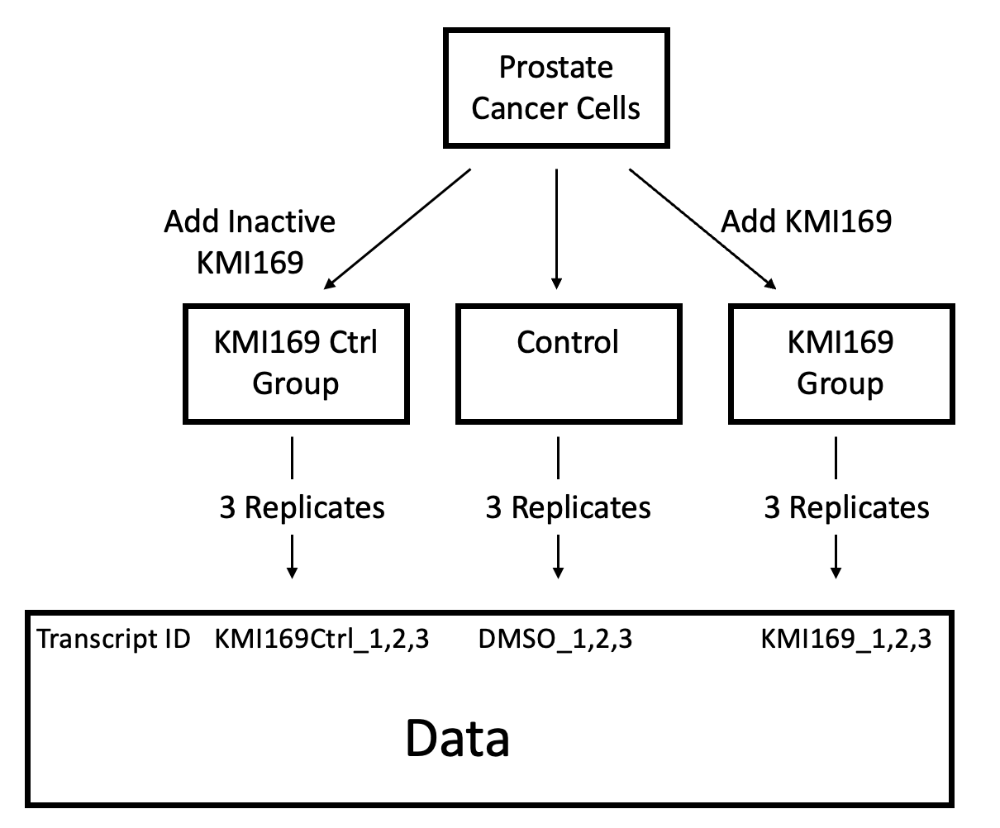

```{r include = FALSE}
# Load libraries, to notify the user if one is not installed
library(BiocManager)
library(GEOquery)
library(biomaRt)
library(edgeR)
```

# Dataset Background
This section outlines how I selected the dataset and basic information about it.

## Selecting the Dataset
As a starting point, I chose to look for a dataset relating to prostate cancer. I searched GEO for that term, which produced 49250 results. To look at the most relevant results, I filtered for entries uploaded within the last 4 years (uploaded after January 1, 2020), containing a supplementary `.txt` file, with data on humans (from the species *Homo sapiens*), collected using expression by high throughput sequencing (to select bulk or single-cell RNA sequencing), and containing at least 6 samples. Adding these restrictions produced 513 results, and I looked through these in reverse chronological order to find datasets with high quality, an associated publication, and an interesting premise. I chose the dataset associated with the publication [Structure-guided design of a selective inhibitor of the methyltransferase KMT9 with cellular activity](https://www.ncbi.nlm.nih.gov/pubmed/38167811)[@wang2024structure], which is stored on GEO[@barrett2012ncbi] at [GEO ID GSE235595](https://www.ncbi.nlm.nih.gov/geo/query/acc.cgi?acc=GSE235595), as it uses an experiment incorporating my secondary interest of structural biology. Further, its publication has a straightforward description of the experimental procedure, which assists in preparing and analyzing the data, and it includes a large number of samples across multiple experimental conditions, which strengthens my ability to draw meaningful conclusions from its data.


## Dataset Basic Information

The experiment associated with [GEO ID GSE235595](https://www.ncbi.nlm.nih.gov/geo/query/acc.cgi?acc=GSE235595) examined a small molecule inhibitor for lysine methyltransferase 9 (KMT9), an enzyme which modifies DNA to increase expression of genes involved in tumor cell proliferation. The researchers tested the inhibitor (KMI169) by measuring RNA expression in prostate cancer cells with no treatment as a negative control, prostate cancer cells treated with KMI169, and prostate cancer cells treated with an modified inactive version of KMI169 as an additional control. There are 9 total samples from 3 replicates across these 3 conditions. 

A figure visualizing this is shown below.

Figure 1: A flow graph showing the 3 experimental groups and their associated data columns.

Below, I use `GEOquery`[@davis2007geoquery] to access metadata information on this dataset and the platform used to produce it.

```{r message = FALSE}
# Download metadata on this GEO dataset and its experimental platform.
# That metadata is rendered inline in the paragraphs below.
geoId <- "GSE235595"
geoEntry <- GEOquery::getGEO(geoId, GSEMatrix = FALSE)
```

The dataset has GEO ID `r geoEntry@header$geo_accession` was submitted on `r geoEntry@header$submission_date` and last updated on `r geoEntry@header$last_update_date`. 

Its experimental design is described as:
`r geoEntry@header$overall_design`

Using this dataset, my analyses over the semester has two goals. First, I will replicate parts of the analysis performed in the paper to verify their conclusion that the KMI169 inhibitor causes decreased expression in cancer-associated genes. Second, I will search for differential expression in genes associated with tumor proliferation due to KMI169 inhibitors, to identify side-effects and potential drawbacks on KMI169 as a drug for prostate cancer. 

# Downloading and Cleaning the Data

## Downloading the Data
We begin by downloading the data from GEO. There are two provided files: `GSE235595_KI169Ctrl_counts_edgeR.txt.gz` and `GSE235595_KI169_counts_edgeR.txt.gz`. The first contains the counts for cells with no treatment and cells treated with inactive KMI169, while the second contains the counts for cells with no treatment and cells treated with KMI169.

```{r}
# Fetch the filenames, and print them to verify the above statement.
geoFileNames <- GEOquery::getGEOSuppFiles(geoId, fetch_files = FALSE)
print(geoFileNames$fname)

# Download the two data files
workingDir <- file.path(getwd())
for (i in seq_along(geoFileNames)) {
  geoFileName <- geoFileNames$fname[i]
  # Only download missing files. Check name if future updates add more files
  if ((geoFileName == "GSE235595_KI169Ctrl_counts_edgeR.txt.gz" || 
       geoFileName == "GSE235595_KI169_counts_edgeR.txt.gz") &&
      ! file.exists(file.path(workingDir, geoId, geoFileName))) {
    geoDownloadData <- GEOquery::getGEOSuppFiles(geoId, 
                                                 filter_regex = geoFileName,
                                                 baseDir = workingDir, 
                                                 fetch_files = TRUE)
  }
}
```
The above code should have downloaded the two files. If fewer than two were downloaded, this indicates the dataset was updated and one of the files was renamed.

We continue by loading the data into R dataframes. The first column is the Transcript ID, the following three columns are the counts in three replicates for the no treatment control (column name `PC_DMSO`), the following three columns are the counts in three replicates for replicates in the treatment group (either inactive or active KMI inhibitor), and the final two columns are the fold-change and p-value between the two groups. The file uses tab characters to separate columns and spaces in the header column names, so specifying tab as separator is required. We can view the data format using tables generated in knitr[@knitr2023]. Ignore the warnings regarding HTMLtools, as supressing warnings might miss more significant warnings.
```{r}
# Load the downloaded files into R dataframes
KMI169CtrlCounts <- read.table(file.path(workingDir, geoId, "GSE235595_KI169Ctrl_counts_edgeR.txt.gz"), 
                               header = TRUE, stringsAsFactors = FALSE, 
                               check.names = TRUE, sep = "\t")
KMI169Counts <- read.table(file.path(workingDir, geoId, "GSE235595_KI169_counts_edgeR.txt.gz"), 
                               header = TRUE, stringsAsFactors = FALSE, 
                               check.names = TRUE, sep = "\t")

# Visualize the data frame format in HTML tables
knitr::kable(KMI169CtrlCounts[1:4, ])
knitr::kable(KMI169Counts[1:4, ])
# Rename rows to Transcript IDs
rownames(KMI169Counts) <- KMI169Counts$Transcript_RepeatID
rownames(KMI169CtrlCounts) <- KMI169CtrlCounts$Transcript_RepeatID
```

Before continuing analysis, we should perform some consistency checks on the data.  
The KMI169Ctrl data has `r nrow(KMI169CtrlCounts)` rows and `r length(unique(KMI169CtrlCounts$Transcript_RepeatID))` unique transcript IDs. These numbers match, so each row is a unique transcript.  
The KMI169 data has `r nrow(KMI169Counts)` rows and `r length(unique(KMI169Counts$Transcript_RepeatID))` unique transcript IDs. These numbers match, so each row is a unique transcript.  
Are all transcript IDs in the KMI169Ctrl dataset in the KMI169 datasets: `r all(KMI169Counts$Transcript_RepeatID %in% KMI169CtrlCounts$Transcript_RepeatID)`.  
Do all transcript counts for the no treatment groups match between KMI169Ctrl and KMI169 datasets: `r all(KMI169Counts$PC_DMSO_1 == KMI169CtrlCounts[KMI169Counts$Transcript_RepeatID, "PC_DMSO_1"]) & all(KMI169Counts$PC_DMSO_2 == KMI169CtrlCounts[KMI169Counts$Transcript_RepeatID, "PC_DMSO_2"]) & 
all(KMI169Counts$PC_DMSO_3 == KMI169CtrlCounts[KMI169Counts$Transcript_RepeatID, "PC_DMSO_3"])`.

Knowing the data is consistent between dataframes, we can merge the relevant columns into a single dataframe.
```{r}
# Select required columns from the dataframes. 
# Use no treatment columns from only one dataframe (arbitrarily KMI169Counts)
KMI169CtrlCounts <- KMI169CtrlCounts[, c("Transcript_RepeatID", "PC_169Ctrl_1", "PC_169Ctrl_2", "PC_169Ctrl_3")]
KMI169Counts <- KMI169Counts[, c("Transcript_RepeatID", 
                                 "PC_DMSO_1", "PC_DMSO_2", "PC_DMSO_3", 
                                 "PC_169_1", "PC_169_2", "PC_169_3")]
allCounts <- merge(KMI169CtrlCounts, KMI169Counts, by = "Transcript_RepeatID")

# View the merged data frame
knitr::kable(allCounts[1:4, ])
```

## Cleaning the Data
To begin cleaning the data, the below code generates a table to show some statistics for each replicate.
```{r}
# Calculate statistics on all data columns
allCountsData <- allCounts[, c("PC_DMSO_1", "PC_DMSO_2", "PC_DMSO_3", 
                               "PC_169Ctrl_1", "PC_169Ctrl_2", "PC_169Ctrl_3",
                               "PC_169_1", "PC_169_2", "PC_169_3")]
allStatistics <- data.frame(min = sapply(allCountsData, min),
                            mean = sapply(allCountsData, mean),
                            median = sapply(allCountsData, median),
                            max = sapply(allCountsData, max))
rownames(allStatistics) <- c("PC_DMSO_1", "PC_DMSO_2", "PC_DMSO_3", 
                             "PC_169Ctrl_1", "PC_169Ctrl_2", "PC_169Ctrl_3",
                             "PC_169_1", "PC_169_2", "PC_169_3")

# Generate a table containing all statistics
knitr::kable(allStatistics)
```

The maximum and mean count within each group is similar between replicates, which indicates there are no significant outliers which must be removed. As the data shows no other sign of measurement error, we will not perform any additional data cleaning.

# Mapping the Data

## Downloading ID Maps
To use this merged dataset in further analysis, we should map the transcript IDs to HUGO gene symbols. The previous tables have shown that transcript IDs are given in the form "NM_XXXXXX" where the Xs represent a 6-digit number. This is the ID format for RefSeq. After querying biomaRt[@durinck2009mapping] for relevant attributes (not shown), we can use this code to download our desired ID mapping.
```{r}
# Establish a connection of the Ensembl human dataset
ensemblMart <- biomaRt::useMart("ensembl")
humanDataset <- biomaRt::useDataset("hsapiens_gene_ensembl", mart = ensemblMart)

# Load the mapping locally if already saved, otherwise query and save
refseqIds <- allCounts$Transcript_RepeatID
refseq2hgncFile <- "refseq2hgnc.rds"
if (file.exists(refseq2hgncFile)) {
  refseq2hgnc <- readRDS(refseq2hgncFile)
} else {
  refseq2hgnc <- biomaRt::getBM(attributes = c("refseq_mrna", "hgnc_symbol"),
                                filters = c("refseq_mrna"),
                                values = refseqIds,
                                mart = humanDataset)
  saveRDS(refseq2hgnc, refseq2hgncFile)
}
```


## Choosing How to Apply ID Maps
With the ID mapping loaded, we can perform some basic checks to verify the coverage.

Among `r nrow(refseq2hgnc)` mappings returned, `r length(unique(refseq2hgnc$refseq_mrna))` RefSeq IDs are represented in those mappings. Early runs of this code found the latter value was smaller than the former, so some RefSeq IDs were mapped to multiple HGNC symbols. Manually examining the RefSeq IDs with multiple matches found they are generally errors, as the HGNC entry for at least one of the associated HGNC symbols does not link to the associated RefSeq ID. As there is no simple way to automatically verify which mappings are correct, I planned to discard all mappings for RefSeq IDs with multiple mappings. However, later runs of this code return the values are the same, so no mappings need to be discarded. The code below discards duplicate mappings as a precaution.

From `r length(refseqIds)` RefSeq IDs in the dataset, Ensembl returned mappings for `r length(unique(refseq2hgnc$refseq_mrna))` of those symbols for a mapping success rate of `r length(unique(refseq2hgnc$refseq_mrna)) / length(refseqIds) * 100`%. While not perfect, this is a good mapping rate which confirms we are applying the correct Ensembl filters. Manually examining some of the unmapped RefSeq IDs found they are entries in the RefSeq database which were removed for insufficient evidence, so their failure to map to HGNC symbols is correct.

Among `r nrow(refseq2hgnc)` RefSeq to HGNC symbol mappings, `r length(unique(refseq2hgnc$hgnc_symbol))` HGNC symbols are unique. This indicates many RefSeq IDs map to each HGNC symbol, which is expected as each gene has one HGNC symbol but each alternate transcript of that gene has a unique RefSeq IDs. As each alternate transcript may serve a different biological role due to changes in included exons, we will not merge entries with the same HGNC symbol and include both RefSeq ID and HGNC symbol in the final table. However, later analysis (in future assignments) will aim to consider differential expression on both the gene level and transcript level to fully elucidate the effect of KMT9 inhibition.

## Applying ID Maps
The following code adds the column for HGNC symbol and excludes transcript rows without associated HGNC symbols.

```{r}
# Select only mappings where the RefSeq ID does not appear in multiple mappings
refseq2hgnc <- refseq2hgnc[! duplicated(refseq2hgnc$refseq_mrna), ]
# Merge the HGNC symbols into the dataset
allCountsHGNC <- merge(allCounts, refseq2hgnc, 
                       by.x = "Transcript_RepeatID", by.y = "refseq_mrna")

# View the dataset with HGNC symbols in a table
knitr::kable(allCountsHGNC[1:4, ])
```

To verify this included all the mapped RefSeq transcripts, we can check that all RefSeq IDs are unique (`r length(unique(allCountsHGNC$Transcript_RepeatID)) == length(allCountsHGNC$Transcript_RepeatID)`) and it has the same length as the number of mapped RefSeqIDs (`r length(allCountsHGNC$Transcript_RepeatID) == length(refseq2hgnc$refseq_mrna)`).

# Applying Normalization

The first step of normalization is converting to counts per million (CPM) to compensate for library size then removing transcripts with very small numbers of counts. As there are three samples in each of the three conditions, we remove transcripts expressed in fewer than three total samples.

```{r}
# allCountsHGNC uses integer data (from the data file), so coerce to numeric
allCountsMatrix <- matrix(c(as.numeric(allCountsHGNC$PC_DMSO_1), 
                            as.numeric(allCountsHGNC$PC_DMSO_2),
                            as.numeric(allCountsHGNC$PC_DMSO_3),
                            as.numeric(allCountsHGNC$PC_169Ctrl_1),
                            as.numeric(allCountsHGNC$PC_169Ctrl_2),
                            as.numeric(allCountsHGNC$PC_169Ctrl_3),
                            as.numeric(allCountsHGNC$PC_169_1),
                            as.numeric(allCountsHGNC$PC_169_2),
                            as.numeric(allCountsHGNC$PC_169_3)), 
                          nrow = nrow(allCountsHGNC), ncol = 9, byrow = FALSE)
colnames(allCountsMatrix) <- c("PC_DMSO_1", "PC_DMSO_2", "PC_DMSO_3", 
                               "PC_169Ctrl_1", "PC_169Ctrl_2", "PC_169Ctrl_3",
                               "PC_169_1", "PC_169_2", "PC_169_3")
minSamples <- 3  # Minimum samples a transcript should be expressed in
minCPM <- 1  # Minimum CPM to be considered expressed
expressedRows <- rowSums(edgeR::cpm(allCountsMatrix) > minCPM) > minSamples
filteredCountsMatrix <- allCountsMatrix[expressedRows, ]
```

Among `r nrow(allCountsMatrix)` transcripts, `r nrow(filteredCountsMatrix)` or `r nrow(filteredCountsMatrix) / nrow(allCountsMatrix) * 100`% are expressed across all samples.

To visualize the effect of removing the least expressed transcripts, below is a density plot of the log CPM before and after filtering. The replicates for the inactive KMI169 are shown in red shades, the replicates for the untreated cells are shown in blue shades, and the replicates for the cells treated with KMI169 are shown in green shades.
```{r fig.width=7, fig.height=6}
# Define a function to create density plots for the log CPM of a dataset
# Each category has a color, replicates have color variations 
plotLog2CPM <- function(countsMatrix, title) {
  plot(density(log2(edgeR::cpm(countsMatrix[, 1]))), col="firebrick1", main = title, ylab="Density", xlab="Log2 CPM")
  lines(density(log2(edgeR::cpm(countsMatrix[, 2]))), col = "firebrick2")
  lines(density(log2(edgeR::cpm(countsMatrix[, 3]))), col = "firebrick3")
  lines(density(log2(edgeR::cpm(countsMatrix[, 4]))), col = "dodgerblue1")
  lines(density(log2(edgeR::cpm(countsMatrix[, 5]))), col = "dodgerblue2")
  lines(density(log2(edgeR::cpm(countsMatrix[, 6]))), col = "dodgerblue3")
  lines(density(log2(edgeR::cpm(countsMatrix[, 7]))), col = "seagreen1")
  lines(density(log2(edgeR::cpm(countsMatrix[, 8]))), col = "seagreen2")
  lines(density(log2(edgeR::cpm(countsMatrix[, 9]))), col = "seagreen3")
}

par(mfrow=c(1, 2))
plotLog2CPM(allCountsMatrix, "All Log2 Density of CPM")
plotLog2CPM(filteredCountsMatrix, "Filtered Log2 Density of CPM")
```

These plots show that the input data has many transcripts with minimal expression, shown by the long left tail below 0 and the peak around -6. Enforcing the minimum expression requirements removes this tail and creates a more symmetrical density distribution. I experimented with varying the minimum CPM for a transcript to be considered expressed, but none provided a clearly better density distribution.

With this improved set of transcripts, we can perform normalization using edgeR[@chen2024edger]. Each group is the three consecutive columns corresponding to an experimental condition.
```{r}
normalizedDGEList <- edgeR::DGEList(counts = filteredCountsMatrix, 
                                    groups = c(1, 1, 1, 2, 2, 2, 3, 3, 3))
normalizedDGEList <- edgeR::calcNormFactors(normalizedDGEList, method = "TMM")
normalizedCPMMatrix <- edgeR::cpm(normalizedDGEList)
```

With normalized counts calculated, we can visualize them using the method above.
```{r fig.width=7, fig.height=6}
par(mfrow=c(1, 2))
plotLog2CPM(filteredCountsMatrix, "Filtered Log2 Density of CPM")
# The counts matrix is already stored as CPM, so we cannot use the function defined above
plot(density(log2(normalizedCPMMatrix[, 1])), col="firebrick1", main = "Normalized Log2 Density of CPM", ylab="Density", xlab="Log2 CPM")
  lines(density(log2(normalizedCPMMatrix[, 2])), col = "firebrick2")
  lines(density(log2(normalizedCPMMatrix[, 3])), col = "firebrick3")
  lines(density(log2(normalizedCPMMatrix[, 4])), col = "dodgerblue1")
  lines(density(log2(normalizedCPMMatrix[, 5])), col = "dodgerblue2")
  lines(density(log2(normalizedCPMMatrix[, 6])), col = "dodgerblue3")
  lines(density(log2(normalizedCPMMatrix[, 7])), col = "seagreen1")
  lines(density(log2(normalizedCPMMatrix[, 8])), col = "seagreen2")
  lines(density(log2(normalizedCPMMatrix[, 9])), col = "seagreen3")
```

This shows that the effect of normalization is relatively small, as the distribution is essentially unchanged. Below, a boxplot shows that the pre-normalization filtered values already have extremely simliar averages and quantiles, which explains why normalization causes minimal change to values. This may be due to the cells being cultured in a controlled laboratory environment, rather than being from different patients with many biological confounding factors.

```{r fig.width=7, fig.height=6}
par(mfrow = c(1, 2))
# Use the same color scheme as above
groupColors <- c("firebrick1", "firebrick2", "firebrick3", "dodgerblue1", "dodgerblue2", "dodgerblue3", "seagreen1", "seagreen2", "seagreen3")
boxplot(log2(edgeR::cpm(filteredCountsMatrix)), col = groupColors, main = "Boxplot of filtered log2 CPMs", ylab = "log2 CPM", xlab = "Sample")
boxplot(log2(normalizedCPMMatrix), col = groupColors, main = "Boxplot of normalized log2 CPMs", ylab = "log2 CPM", xlab = "Sample")
```

As a sanity check, is there some difference between the CPM for the filtered dataset and the normalized CPM: `r any(edgeR::cpm(filteredCountsMatrix) != normalizedCPMMatrix)`.


# Saving the Normalized Data
As the final step, we will store the normalized values back into a dataframe. For each experimental condition, we will store each transcript's expression in all three replicates and its average across the three replicates. **Note that rownames are set to transcript IDs, to enable further analysis about differential expression of gene transcripts.**
```{r}
# Select the RefSeq and HUGO gene IDs for the expressed transcripts
filteredRefSeqIds <- allCountsHGNC$Transcript_RepeatID[expressedRows]
filteredHGNC <- allCountsHGNC$hgnc_symbol[expressedRows]
# Compute the averages of replicates for each experimental condition
DMSOMean <- (normalizedCPMMatrix[, 1] + normalizedCPMMatrix[, 2] + normalizedCPMMatrix[, 3]) / 3
KMI169CtrlMean <- (normalizedCPMMatrix[, 4] + normalizedCPMMatrix[, 5] + normalizedCPMMatrix[, 6]) / 3
KMI169Mean <- (normalizedCPMMatrix[, 7] + normalizedCPMMatrix[, 8] + normalizedCPMMatrix[, 9]) / 3

normalizedFinal <- data.frame(refseq_id = filteredRefSeqIds, 
                             hgnc_symbol = filteredHGNC,
                             CPM_DMSO_1 = normalizedCPMMatrix[, 1],
                             CPM_DMSO_2 = normalizedCPMMatrix[, 2], 
                             CPM_DMSO_3 = normalizedCPMMatrix[, 3],
                             CPM_DMSO_mean = DMSOMean,
                             CPM_KMI169Ctrl_1 = normalizedCPMMatrix[, 4],
                             CPM_KMI169Ctrl_2 = normalizedCPMMatrix[, 5],
                             CPM_KMI169Ctrl_3 = normalizedCPMMatrix[, 6],
                             CPM_KMI169Ctrl_mean = KMI169CtrlMean,
                             CPM_KMI169_1 = normalizedCPMMatrix[, 7],
                             CPM_KMI169_2 = normalizedCPMMatrix[, 8],
                             CPM_KMI169_3 = normalizedCPMMatrix[, 9],
                             CPM_KMI169_mean = KMI169Mean,
                             row.names = filteredRefSeqIds)
normalizedFileName <- paste(geoId, "normalized_counts.txt", sep = "_")
if (! file.exists(file.path(workingDir, geoId, normalizedFileName))) {
  write.table(normalizedFinal, file.path(workingDir, geoId, normalizedFileName),
              quote = FALSE, sep = "\t", row.names = TRUE)
}

```

The final dataset covers `r nrow(normalizedFinal)` transcripts corresponding to `r length(unique(normalizedFinal$hgnc_symbol))` HUGO genes across 3 samples, each with 3 replicates and an aggregate column.

## Links for Marking
[Why is this dataset of interest to you?](#selecting-the-dataset)  
See Selecting the Dataset.

[What are the control and test conditions of the dataset](#dataset-basic-information)  
See Dataset Basic Information.

[How many samples are in each of the conditions of the dataset](#dataset-basic-information)  
See Dataset Basic Information.

[Were there expression values that were not unique for specific genes? How did you handle these?](#choosing-how-to-apply-id-maps)  
All RefSeq IDs in the initial dataset are unique, but some RefSeq IDs mapped to multiple HUGO gene symbols. All of these were discarded. See Choosing How to Apply ID Maps.

[Were there expression values that could not be mapped to current HUGO symbols?](#choosing-how-to-apply-id-maps)  
Some RefSeq IDs did not map to HUGO symbols in early runs, but later runs do not replicate this. If they occur, they are discarded. See Choosing How to Apply ID Maps.


[Were there any outliers in your dataset? How were they handled in the originating paper? How many outliers were removed?](#cleaning-the-data)  
No evidence of outliers were found, so no processing to remove them was performed. See Cleaning the Data.

[How did you handle replicates?](#saving-the-normalized-data)  
Replicates were normalized as a group. The final dataset contains all replicates and an average column for all replicates from the same condition. See Save the Normalized Data

[What is the final coverage of your dataset?](#saving-the-normalized-data)  
See Save the Normalized Data.

# References
