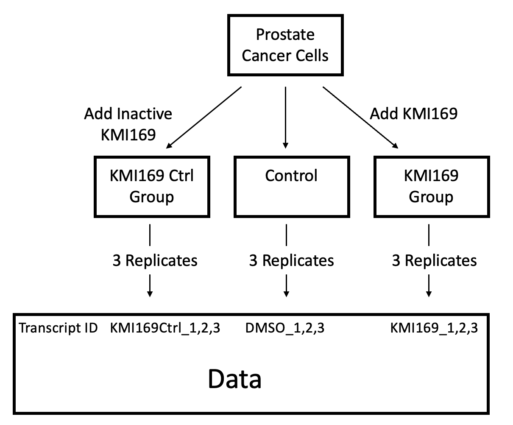

```{r include = FALSE}
# Load libraries, to notify the user if one is not installed
library(limma)
library(BiocManager)
library(GEOquery)
library(biomaRt)
library(edgeR)
library(knitr)
library(ComplexHeatmap)
library(circlize)
library(gprofiler2)
```

# Introduction: Assignment 1 Recap

## Dataset Overview
This assignment analyzes the dataset associated with the publication [Structure-guided design of a selective inhibitor of the methyltransferase KMT9 with cellular activity](https://www.ncbi.nlm.nih.gov/pubmed/38167811)[@wang2024structure]. This publication examines the effect of inhibiting the enzyme lysine methyltransferase (KMT9) in prostate cancer cells, which was associated with tumor cell proliferation in previous studies. The researchers developed a KMT9 inhibitor (KMI169) and used bulk RNASeq to quantify RNA expression in prostate cancer cells treated with KMI169, an inactive variant of KMI169 (as a control for the inhibitor), and DMSO (as a no treatment negative control). Each treatment uses 3 replicates, for 9 total samples. See Figure 1 for a visual.


Figure 1: A diagram showing the 3 experimental groups and their relationship to the raw dataset.

## Preprocessing Data
This introduction will step through the data processing performed in Assignment 1 to prepare the normalized count dataframe. The raw dataset is stored on GEO[@barrett2012ncbi] at [GEO ID GSE235595](https://www.ncbi.nlm.nih.gov/geo/query/acc.cgi?acc=GSE235595). We can download it using the GEOQuery R package[@davis2007geoquery].
```{r}
# Set the GEO ID for this dataset
geoId <- "GSE235595"

# Query the supplementary filenames and download them (if not already present)
geoFileNames <- GEOquery::getGEOSuppFiles(geoId, fetch_files = FALSE)
workingDir <- file.path(getwd())
for (i in seq_along(geoFileNames)) {
  geoFileName <- geoFileNames$fname[i]
  # Only download missing files. Check name if future updates add more files
  if ((geoFileName == "GSE235595_KI169Ctrl_counts_edgeR.txt.gz" || 
       geoFileName == "GSE235595_KI169_counts_edgeR.txt.gz") &&
      ! file.exists(file.path(workingDir, geoId, geoFileName))) {
    geoDownloadData <- GEOquery::getGEOSuppFiles(geoId, 
                                                 filter_regex = geoFileName,
                                                 baseDir = workingDir, 
                                                 fetch_files = TRUE)
  }
}
```

The next step is to load the data files into R and merge their relevant columns into one data frame.
```{r}
# Load the downloaded files into R dataframes
KMI169CtrlCounts <- read.table(file.path(workingDir, geoId, "GSE235595_KI169Ctrl_counts_edgeR.txt.gz"), 
                               header = TRUE, stringsAsFactors = FALSE, 
                               check.names = TRUE, sep = "\t")
KMI169Counts <- read.table(file.path(workingDir, geoId, "GSE235595_KI169_counts_edgeR.txt.gz"), 
                           header = TRUE, stringsAsFactors = FALSE, 
                           check.names = TRUE, sep = "\t")
# Rename rows to Transcript IDs
rownames(KMI169Counts) <- KMI169Counts$Transcript_RepeatID
rownames(KMI169CtrlCounts) <- KMI169CtrlCounts$Transcript_RepeatID

# Select required columns from the dataframes. 
# Use no treatment columns from only one dataframe (arbitrarily KMI169Counts)
KMI169CtrlCounts <- KMI169CtrlCounts[, c("Transcript_RepeatID", "PC_169Ctrl_1", "PC_169Ctrl_2", "PC_169Ctrl_3")]
KMI169Counts <- KMI169Counts[, c("Transcript_RepeatID", 
                                 "PC_DMSO_1", "PC_DMSO_2", "PC_DMSO_3", 
                                 "PC_169_1", "PC_169_2", "PC_169_3")]
allCounts <- merge(KMI169CtrlCounts, KMI169Counts, by = "Transcript_RepeatID")
```

This combined dataframe provides transcript IDs as RefSeqIDs, but we aim to work with HUGO gene symbols in addition. We can perform this mapping using the biomaRt R package[@durinck2009mapping]. We add an extra step to filter out mappings where the HUGO gene symbol is the empty string; this step was missed in Assignment 1.
```{r}
# Establish a connection of the Ensembl human dataset
ensemblMart <- biomaRt::useMart("ensembl")
humanDataset <- biomaRt::useDataset("hsapiens_gene_ensembl", mart = ensemblMart)

# Load the mapping locally if already saved, otherwise query and save
refseqIds <- allCounts$Transcript_RepeatID
refseq2hgncFile <- "refseq2hgnc.rds"
if (file.exists(refseq2hgncFile)) {
  refseq2hgnc <- readRDS(refseq2hgncFile)
} else {
  refseq2hgnc <- biomaRt::getBM(attributes = c("refseq_mrna", "hgnc_symbol"),
                                filters = c("refseq_mrna"),
                                values = refseqIds,
                                mart = humanDataset)
  saveRDS(refseq2hgnc, refseq2hgncFile)
}

# Remove mappings which correspond to an empty HGNC symbol
refseq2hgnc <- refseq2hgnc[refseq2hgnc$hgnc != "", ]
# Select only mappings where the RefSeq ID does not appear in multiple mappings
refseq2hgnc <- refseq2hgnc[! duplicated(refseq2hgnc$refseq_mrna), ]
# Merge the HGNC symbols into the dataset
allCountsHGNC <- merge(allCounts, refseq2hgnc, 
                       by.x = "Transcript_RepeatID", by.y = "refseq_mrna")
```

This data includes `r length(unique(allCountsHGNC$Transcript_RepeatID))` unique transcripts (RefSeq IDs) and `r length(unique(allCountsHGNC$hgnc))` unique HUGO gene symbols. This occurs because each gene may have multiple alternate transcripts. Because alternate transcripts often serve different biological purposes, we will keep all transcripts to attempt to find differential expression in alternate transcripts.


## Normalizing Data
With HUGO gene symbols assigned, we can begin preprocessing gene counts using the edgeR R package[@chen2024edger]. The first step is converting to counts per million and filtering the dataset to transcripts with at least 3 counts per million (equal to the number of samples).

```{r}
# allCountsHGNC uses integer data (from the data file), so coerce to numeric
allCountsMatrix <- matrix(c(as.numeric(allCountsHGNC$PC_DMSO_1), 
                            as.numeric(allCountsHGNC$PC_DMSO_2),
                            as.numeric(allCountsHGNC$PC_DMSO_3),
                            as.numeric(allCountsHGNC$PC_169Ctrl_1),
                            as.numeric(allCountsHGNC$PC_169Ctrl_2),
                            as.numeric(allCountsHGNC$PC_169Ctrl_3),
                            as.numeric(allCountsHGNC$PC_169_1),
                            as.numeric(allCountsHGNC$PC_169_2),
                            as.numeric(allCountsHGNC$PC_169_3)), 
                          nrow = nrow(allCountsHGNC), ncol = 9, byrow = FALSE)
colnames(allCountsMatrix) <- c("PC_DMSO_1", "PC_DMSO_2", "PC_DMSO_3", 
                               "PC_169Ctrl_1", "PC_169Ctrl_2", "PC_169Ctrl_3",
                               "PC_169_1", "PC_169_2", "PC_169_3")
minSamples <- 3  # Minimum samples a transcript should be expressed in
minCPM <- 1  # Minimum CPM to be considered expressed
expressedRows <- rowSums(edgeR::cpm(allCountsMatrix) > minCPM) > minSamples
filteredCountsMatrix <- allCountsMatrix[expressedRows, ]
```

Of the `r nrow(allCountsMatrix)` total transcripts, `r nrow(filteredCountsMatrix)` or `r nrow(filteredCountsMatrix) / nrow(allCountsMatrix) * 100`% meet the minimum expression level. We normalize the counts by grouping all replicates from each experimental condition.

```{r}
normalizedDGEList <- edgeR::DGEList(counts = filteredCountsMatrix, 
                                    groups = c(1, 1, 1, 2, 2, 2, 3, 3, 3))
normalizedDGEList <- edgeR::calcNormFactors(normalizedDGEList, method = "TMM")
normalizedCPMMatrix <- edgeR::cpm(normalizedDGEList)
```

Normalization has a relatively small effect on this dataset because the means and standard deviation of the pre-normalization counts is very similar between replicates (Figure 2).

```{r fig.width=7, fig.height=6}
par(mfrow = c(1, 2))
groupColors <- c("firebrick1", "firebrick2", "firebrick3", "dodgerblue1", "dodgerblue2", "dodgerblue3", "seagreen1", "seagreen2", "seagreen3")
boxplot(log2(edgeR::cpm(filteredCountsMatrix)), col = groupColors, main = "Boxplot of filtered log2 CPMs", ylab = "log2 CPM", xlab = "Sample")
boxplot(log2(normalizedCPMMatrix), col = groupColors, main = "Boxplot of normalized log2 CPMs", ylab = "log2 CPM", xlab = "Sample")
```
Figure 2: A bar plot of log counts per million before and after normalization. The three replicates in each experimental condition are colored similarly: bars for the no treatment group (PC_DMSO) are red, bars for the group treated with inactive KMI169 (PC_169Ctrl) are blue, and bars for the group treated with active KMI169 (PC_169) are green.

The final step is merging the normalized counts with the HGNC identifiers and calculating average counts for each experimental group. The rownames in this data are the transcript IDs and a table of the first few rows is shown using Knitr[@knitr2023].
```{r}
# Select the RefSeq and HUGO gene IDs for the expressed transcripts
filteredRefSeqIds <- allCountsHGNC$Transcript_RepeatID[expressedRows]
filteredHGNC <- allCountsHGNC$hgnc_symbol[expressedRows]
# Compute the averages of replicates for each experimental condition
DMSOMean <- (normalizedCPMMatrix[, 1] + normalizedCPMMatrix[, 2] + normalizedCPMMatrix[, 3]) / 3
KMI169CtrlMean <- (normalizedCPMMatrix[, 4] + normalizedCPMMatrix[, 5] + normalizedCPMMatrix[, 6]) / 3
KMI169Mean <- (normalizedCPMMatrix[, 7] + normalizedCPMMatrix[, 8] + normalizedCPMMatrix[, 9]) / 3

normalizedHGNC <- data.frame(refseq_id = filteredRefSeqIds, 
                             hgnc_symbol = filteredHGNC,
                             CPM_DMSO_1 = normalizedCPMMatrix[, 1],
                             CPM_DMSO_2 = normalizedCPMMatrix[, 2], 
                             CPM_DMSO_3 = normalizedCPMMatrix[, 3],
                             CPM_DMSO_mean = DMSOMean,
                             CPM_KMI169Ctrl_1 = normalizedCPMMatrix[, 4],
                             CPM_KMI169Ctrl_2 = normalizedCPMMatrix[, 5],
                             CPM_KMI169Ctrl_3 = normalizedCPMMatrix[, 6],
                             CPM_KMI169Ctrl_mean = KMI169CtrlMean,
                             CPM_KMI169_1 = normalizedCPMMatrix[, 7],
                             CPM_KMI169_2 = normalizedCPMMatrix[, 8],
                             CPM_KMI169_3 = normalizedCPMMatrix[, 9],
                             CPM_KMI169_mean = KMI169Mean,
                             row.names = filteredRefSeqIds)

knitr::kable(normalizedHGNC[1:4, ])
```
Table 1: The first 4 rows in the normalized count data generated by Assignment 1. It includes 14 columns with the RefSeq ID, HUGO gene ID, and normalized counts and replicate means for all three experimental groups. Ignore the S3 methods warning, as muting warnings may hide more important warnings.

For more information on the preprocessing and normalization process, see [Assignment 1](https://github.com/bcb420-2024/Isaiah_Hazelwood/blob/main/A1_IsaiahHazelwood.nb.html).

# Differential Gene Expression

## Determining Groups Via MDS Plots
Before determining differential gene expression, we must define the groups to compare. We expect the three replicates in each experimental condition will form a group, but we can verify this using an MDS plot generated using Limma[@ritchie2015limma].

```{r fig.width=7, fig.height=6}
# Create an MDS plot from the normalized count data matrix
limma::plotMDS(normalizedCPMMatrix, labels= NULL, pch = 19, col = groupColors)
legend("topright", legend = colnames(normalizedCPMMatrix), pch = 19, col = groupColors, 
       title = "Sample", bty = "n", cex = 0.75)
title("MDS Plot of Normalized Data Samples Colored by Condition")
```
Figure 3: An MDS plot showing the 9 samples clustered in two dimensions based on similarity of expression patterns. Samples from the same experimental treatment are given similar colors. 

Figure 3 shows the three replicates from each experimental condition are generally closest to the other samples from the same condition (primarily in dimension 1, with high spread in dimension 2), which justifies grouping by experimental condition. Additionally, the two control conditions (no treatment DMSO and inactive KMI169) are very close to each other and separated from the experimental condition (active KMI169), which indicates the KMI169 treatment affects transcription compared to the other treatments.

## Differential Expression with edgeR
We will determine differential expression using the quasi-likelihood model provided by edgeR[@chen2024edger]. Both the edgeR library and quasi-likelihood model are recommended which is preferred for bulk RNASeq experiments, and can be easily applied in R. Like the paper, we will compare the KMI169 experimental group and inactive KMI169 experimental group against the DMSO control group to verify KMI169 alters gene expression while the inactive version fails to inhibit KMT9 and has minimal effect in the cell. Analysis returns both p-values and corrected p-values under the Benjamini-Hochberg procedure, which was chosen as it is the default and generally most robust multiple correction procedure.

```{r}
# Define the experimental groups corresponding to the columns and the model
experimentalGroups <- factor(c(1, 1, 1, 2, 2, 2, 3, 3, 3))
DEmodel <- model.matrix(~experimentalGroups)

# Create a DGE list from filtered counts, then estimate dispersion
DEdata <- filteredCountsMatrix
rownames(DEdata) <- filteredRefSeqIds
DEdata <- edgeR::DGEList(DEdata, groups = experimentalGroups)
DEdata <- edgeR::estimateDisp(DEdata, DEmodel)

# Set test correction method, fit the model, and calculate differential expression
DEmodelfit <- edgeR::glmQLFit(DEdata, DEmodel)
QLFKMI169CtrlvDMSO <- edgeR::glmQLFTest(DEmodelfit, coef=2)
QLFKMI169vDMSO <- edgeR::glmQLFTest(DEmodelfit, coef=3)

# Access the results sorted by Pvalue
KMI169CtrlDEResults <- edgeR::topTags(QLFKMI169CtrlvDMSO, sort.by = "PValue", 
                                      n = nrow(normalizedHGNC), adjust.method = "BH")
KMI169DEResults <- edgeR::topTags(QLFKMI169vDMSO, sort.by = "PValue", 
                                  n = nrow(normalizedHGNC), adjust.method = "BH")
```

The top differentially expressed genes for the group treated with KMI169 results are shown below in Table 2. They include the transcript IDs (row names), the log fold change compared to DMSO no treatment (`logFC`), the log counts per million in the KMI169 treated samples (`log CPM`), the F-statistic (`F`), the p-value (`Pvalue`), and the corrected p-value (`FDR`, false discovery rate). Note that this table shows the p-value and FDR as zeros because they are very small numbers.

```{r}
knitr::kable(KMI169DEResults$table[1:5, ])
```
Table 2: Top 5 differentially expressed genes between the samples treated with KMI169 and samples with no treatment. 

The publication uses a p-value threshold of 0.05 during all analysis, so we will also use this threshold to determine the significantly expressed transcripts. Applying this threshold to the unnormalized p-value provides `r sum(KMI169CtrlDEResults$table$PValue < 0.05)` significant transcripts from the inactive KMI169 group and `r sum(KMI169DEResults$table$PValue < 0.05)` significant transcripts from the KMI169 group. The following code selects significant transcripts below using this threshold on the corrected P-value.
```{r}
# Select significantly differentially expressed transcripts, and over and under expressed
SigKMI169CtrlDEResults <- KMI169CtrlDEResults$table[KMI169CtrlDEResults$table$FDR < 0.05, ]
SigUpKMI169CtrlDEResults <- KMI169CtrlDEResults$table[KMI169CtrlDEResults$table$FDR < 0.05 & KMI169CtrlDEResults$table$logFC > 0, ]
SigDownKMI169CtrlDEResults <- KMI169CtrlDEResults$table[KMI169CtrlDEResults$table$FDR < 0.05 & KMI169CtrlDEResults$table$logFC < 0, ]
SigKMI169DEResults <- KMI169DEResults$table[KMI169DEResults$table$FDR < 0.05, ]
SigUpKMI169DEResults <- KMI169DEResults$table[KMI169DEResults$table$FDR < 0.05 & KMI169DEResults$table$logFC > 0, ]
SigDownKMI169DEResults <- KMI169DEResults$table[KMI169DEResults$table$FDR < 0.05 & KMI169DEResults$table$logFC < 0, ]
```

There are `r nrow(SigKMI169CtrlDEResults)` significantly expressed transcripts from the inactive KMI169 group (`r nrow(SigKMI169CtrlDEResults) / nrow(KMI169CtrlDEResults$table) * 100`% of all transcripts), of which `r nrow(SigUpKMI169CtrlDEResults)` (`r nrow(SigUpKMI169CtrlDEResults) / nrow(SigKMI169CtrlDEResults) * 100`% of significantly expressed) are overexpressed and `r nrow(SigDownKMI169CtrlDEResults)` (`r nrow(SigDownKMI169CtrlDEResults) / nrow(SigKMI169CtrlDEResults) * 100`%) are underexpressed. This strongly reflects the MDS plot's indication that the inactive KMI169 group has expression very similar to the DMSO control group. 

There are `r nrow(SigKMI169DEResults)` significantly expressed transcripts from the KMI169 group (`r nrow(SigKMI169DEResults) / nrow(KMI169DEResults$table) * 100`% of all transcripts), of which `r nrow(SigUpKMI169DEResults)` (`r nrow(SigUpKMI169DEResults) / nrow(SigKMI169DEResults) * 100`% of significantly expressed) are overexpressed and `r nrow(SigDownKMI169DEResults)` (`r nrow(SigDownKMI169DEResults) / nrow(SigKMI169DEResults) * 100`%) are underexpressed. This again reflects the MDS plot's indication that KMI169 treatment changes expression compared to control, but later analysis is required to determine the effects of the change and if it is due to KMI169 inhibiting KMT9.

## Visualizing Differential Expression

Before continuing to over-representation analysis, we will create figures to visualize the significantly expression transcripts. Below (Figure 4) is a volcano plot of the inactive KMI169 group, showing fold change of transcripts against control against the corrected P-value. Only one transcript, `r rownames(SigKMI169CtrlDEResults)[1]`, is significantly differentially expressed.

```{r fig.width=7, fig.height=6}
# Genes are 1 for no expression, 2 for overexpressed, 3 for underexpressed
KMI169CtrlExpressionType <- (1 * (rownames(KMI169CtrlDEResults$table) %in% rownames(SigUpKMI169CtrlDEResults)) + 
                             2 * (rownames(KMI169CtrlDEResults$table) %in% rownames(SigDownKMI169CtrlDEResults))) + 1
KMI169CtrlColors <- c("ivory4", "firebrick2", "dodgerblue2")[KMI169CtrlExpressionType]
plot(x = KMI169CtrlDEResults$table$logFC, y = -log10(KMI169CtrlDEResults$table$FDR), 
     col = KMI169CtrlColors, pch = 19, cex = 0.7,
     main = "Volcano Plot of Inactive KMI169 Transcript Expression",
     xlab = "log2 Fold Change", ylab = "-log10 FDR")
abline(h = -log10(0.05), col = "wheat4", lty = 2)
legend("right", legend = c("No Change", "Overexpressed", "Underexpressed"), pch = 15, col = c("ivory4", "firebrick2", "dodgerblue2"), title = "Expression Type", bty = "n", cex = 1.0)
```
Figure 4: A volcano plot showing Fold Change of transcripts in the inactive KMI169 group compared to their corrected P-value. The horizontal line indicates the 0.05 p-value threshold, and only one transcript is significantly expressed.

This plot reveals that two additional transcripts, `r rownames(KMI169CtrlDEResults)[2]` and `r rownames(KMI169CtrlDEResults)[3]` approach the 0.05 p-value threshold, but do not exceed it. However, the majority of other transcripts have a very low p-value and fold change.

Below (Figure 5) is a similar volcano plot of the KMI169 group.
```{r fig.width=7, fig.height=6}
# Genes are 1 for no expression, 2 for overexpressed, 3 for underexpressed
KMI169ExpressionType <- (1 * (rownames(KMI169DEResults$table) %in% rownames(SigUpKMI169DEResults)) + 
                             2 * (rownames(KMI169DEResults$table) %in% rownames(SigDownKMI169DEResults))) + 1
KMI169Colors <- c("ivory4", "firebrick2", "dodgerblue2")[KMI169ExpressionType]
plot(x = KMI169DEResults$table$logFC, y = -log10(KMI169DEResults$table$FDR), 
     col = KMI169Colors, pch = 19, cex = 0.5,
     main = "Volcano Plot of KMI169 Transcript Expression",
     xlab = "log2 Fold Change", ylab = "-log10 FDR")
abline(h = -log10(0.05), col = "wheat4", lty = 2)
legend("right", legend = c("No Change", "Overexpressed", "Underexpressed"), pch = 15, col = c("ivory4", "firebrick2", "dodgerblue2"), title = "Expression Type", bty = "n", cex = 1.0)
```
Figure 5: A volcano plot showing Fold Change of transcripts in the inactive KMI169 group compared to their corrected P-value. The horizontal line indicates the 0.05 p-value threshold, significantly overexpressed transcripts are colored red, and significantly underexpressed transcripts are colored blue. 

This plot reveals the KMI169 group has both a large number of significantly expressed transcripts and transcripts with a large fold change from the control DMSO expression (the outliers on the x-axis). Further, the increase in fold change among overexpression outliers exceeds the decrease in fold change among underexpression outliers, though the overall count statistics from generating these sets indicate slightly more transcripts are underexpressed than overexpressed.

As another visualization of the expression between groups, we can generate a clustered heatmap of fold change in significantly expressed transcripts using the ComplexHeatmap package[@gu2022complex] and the Circlize package[@gu2014circlize] to generate colors. The 0.05 threshold provided `r nrow(SigKMI169DEResults)` significantly expressed transcripts in the KMI169 group, which is too many to construct a heatmap. Instead, we will choose the top 500 (ranked by FDR) to keep the heatmap size manageable.

```{r}
# Select the 500 transcripts with highest FDR
KMI169Top500 <- rownames(KMI169DEResults$table)[order(KMI169DEResults$table$FDR, decreasing = FALSE)[1:500]]
KMI169HeatmapData <- normalizedCPMMatrix
rownames(KMI169HeatmapData) <- filteredRefSeqIds
KMI169HeatmapData <- KMI169HeatmapData[rownames(KMI169HeatmapData) %in% KMI169Top500, ]
# Scale the expression values of the top 500 transcripts
KMI169HeatmapData <- t(scale(t(KMI169HeatmapData)))

# Select heatmap colors
if (min(KMI169HeatmapData) >= 0) { # If all positive, range from white to red
  KMI169HeatmapColors <- circlize::colorRamp2(c(0, max(KMI169HeatmapData)), 
                                              c("white", "red"))
} else {
  KMI169HeatmapColors <- circlize::colorRamp2(c(min(KMI169HeatmapData), max(KMI169HeatmapData)), 
                                              c("blue", "red"))
}

# Create heatmap annotations
KMI169HeatmapAnnotDF <- data.frame(sample = colnames(KMI169HeatmapData))
names(groupColors) <- colnames(KMI169HeatmapData)
KMI169HeatmapAnnot <- ComplexHeatmap::HeatmapAnnotation(df = KMI169HeatmapAnnotDF, 
                                                        col = list(sample = groupColors), 
                                                        show_legend = TRUE)

# Generate the heatmap
KMI169Heatmap <- ComplexHeatmap::Heatmap(KMI169HeatmapData, col = KMI169HeatmapColors, 
                                         top_annotation = KMI169HeatmapAnnot,
                                         cluster_rows = TRUE, cluster_columns = TRUE, 
                                         show_column_names = FALSE, show_row_names = FALSE,
                                         show_heatmap_legend = TRUE)
KMI169Heatmap
```
Figure 6: A Heatmap of expression values in the top 500 differentially expressed genes when comparing the KMI169 group against the control group. Rows and columns are clustered by similarity and the annotation guide shows which columns correspond to which samples.

This heatmap reflects that the most differentially expressed transcripts form two groups: one upregulated in the KMI169 treatment (the top rows) and one downregulated in the KMI169 treatment. (the bottom rows) It further shows that the no treatment and inactive KMI169 groups are very similar expression, as they cluster together and resemble a single large cluster. Finally, all replicates within each experimental method cluster together, which is a good conformation that the main factor affecting expression is the treatment method rather than variation between replicates. 

# Over-representation Analysis
Over-representation analysis compares the list of differentially expressed genes (or transcripts) against a list of gene sets with biological similarities to identify what biological attributes are affected by the change in gene expression. It requires two steps: selecting an annotation dataset containing biological gene lists and performing the analysis between our differentially expressed list and that annotation dataset.

## Loading the Annotation Dataset
I chose to use the Pathway Commons annotation dataset[@cerami2010pathway], which collects pathways and interaction data from 22 other public dataset. It is accessible via [a website](https://www.pathwaycommons.org/), [a web API](https://www.pathwaycommons.org/pc2/), or [an archive download](https://www.pathwaycommons.org/archives/). The archive offers a GMT format download using HGNC identifiers, which is the best choice for our purposes because GMT is used by many analysis programs (including G:Profiler, discussed below) and we have HGNC identifiers for our data available. For more information about Pathway Commons, see [my Annotation Sources journal entry](https://github.com/bcb420-2024/Isaiah_Hazelwood/wiki/Annotation-Sources). We will download the archived version 12 of Pathway Commons, which at time of writing is the newest version and the version offered on the website.

```{r}
# Download the Pathway Commons HGNC GMT archive v12 (latest at time of writing)
PC_HGNC_GMT_url <- "https://www.pathwaycommons.org/archives/PC2/v12/PathwayCommons12.All.hgnc.gmt.gz"
if (! file.exists(file.path(workingDir, "PC_HGNC_v12.gmt.gz"))) {
  download.file(PC_HGNC_GMT_url, destfile = file.path(workingDir, "PC_HGNC_v12.gmt.gz"))
}

# Unzip the .gz file using a GEOquery function
if (! file.exists(file.path(workingDir, "PC_HGNC_v12.gmt"))) {
  GEOquery::gunzip(filename = file.path(workingDir, "PC_HGNC_v12.gmt.gz"), 
                   destname = file.path(workingDir, "PC_HGNC_v12.gmt"), 
                   remove = FALSE)
}
```

## Over-representation Analysis with G:Profiler
Following the recommendation in lecture, we will perform over-representation analysis with G:Profiler[@reimand2007g]. G:Profiler is a web-based enrichment analysis tool which provides several common annotation datasets, but further offers uploading custom annotation datasets and an R package interface. It provides many options to customize the query including whether the genes are ordered by significance, the multiple test correction method, and the significance threshold.

Given the inactive KMI169 group contains very few significantly enriched transcripts, we will not perform over-representation analysis with it as it lacks a sufficient sample size. 

While our previous analysis provided transcript IDs, we will convert this to a list of HGNC IDs to match the format of the Pathway Commons GMT file.
```{r}
# Map the significantly differentially expressed transcripts to HGNCs
SigKMI169HGNC <- unique(normalizedHGNC[rownames(normalizedHGNC) %in% rownames(SigKMI169DEResults), 
                                       "hgnc_symbol"])
SigUpKMI169HGNC <- unique(normalizedHGNC[rownames(normalizedHGNC) %in% rownames(SigUpKMI169DEResults), 
                                         "hgnc_symbol"])
SigDownKMI169HGNC <- unique(normalizedHGNC[rownames(normalizedHGNC) %in% rownames(SigDownKMI169DEResults), 
                                           "hgnc_symbol"])
```

The `r nrow(SigKMI169DEResults)` differentially expressed transcripts, with `r nrow(SigUpKMI169DEResults)` overrepresented and `r nrow(SigDownKMI169DEResults)` underrepresented, correspond to `r length(SigKMI169HGNC)` differentially expressed genes, with `r length(SigUpKMI169HGNC)` overrepresented and `r length(SigDownKMI169HGNC)` underrepresented. 

We can submit this list of HGNC identifiers alongside the downloaded annotation data to G:Profiler for analysis. We will return all results and apply the FDR multiple test correction method. Using gprofiler2 methods generates some output text below this cell, which is normal and can be ignored.
```{r}
# Upload the annotation GMT file to G:Profiler. It returns an ID to use as organism.
PC_GMT_ID <- gprofiler2::upload_GMT_file(gmtfile = file.path(workingDir, "PC_HGNC_v12.gmt"))

# Query G:Profiler with our full list of significant genes
GProfilerResults <- gprofiler2::gost(query = SigKMI169HGNC, organism = PC_GMT_ID, 
                                     significant = FALSE, # Return all results
                                     ordered_query = FALSE, # Treat as unordered list
                                     correction_method = "fdr")
```

The term name column contains additional metadata, so the following code extracts the term name and stores it in that column. The table shows the top few results and most important columns in the results which are corrected p-value, number of items in the gene set, the number of items in the gene set which are in our significant gene list, and the term name. Note that small p-values are printed as 0 due to rounding.

```{r}
# The term name is stored as "name: XXX; datasource: XXX; organism: XXX; idtype: XXX"
# This function extracts the name
extractTermNames <- function(termNames) {
  termNames <- unlist(lapply(strsplit(termNames, "; "), function(x) {x[1]})) # "name: XXX"
  termNames <- unlist(lapply(strsplit(termNames, ": "), function(x) {x[2]})) # "XXX"
  return(termNames)
}

# Create a table with the most relevant result columns
AllGProfilerResults <- GProfilerResults$result
AllGProfilerResults$name <- extractTermNames(AllGProfilerResults$term_name)
AllGProfilerResults <- AllGProfilerResults[, c("p_value", "term_size", "intersection_size", 
                                               "name")]
# Remove gene sets with identical names and term sizes, as these are likely duplicates
AllGProfilerResults <- AllGProfilerResults[!duplicated(AllGProfilerResults[, c("term_size", "intersection_size", "name")]), ]

# Display the first few rows of the results table
knitr::kable(AllGProfilerResults[1:5, ])
```
Table 3: The top results from over-representation analysis on all significantly expressed genes using G:Profiler.

There are `r nrow(AllGProfilerResults)` total gene sets returned from this analysis, using no thresholding on p-value. Setting a loose threshold of 0.10 produces `r sum (AllGProfilerResults$p_value < 0.10)` gene sets, using the standard threshold of 0.05 produces `r sum (AllGProfilerResults$p_value < 0.05)` gene sets, and using a strict threshold of 0.01 produces `r sum (AllGProfilerResults$p_value < 0.01)` gene sets. We will filter using the strict threshold as it still provides a large number of gene sets to consider, but will only show and analyze the top 20 here.

```{r}
# Select gene sets with corrected p-value below 0.01
SigGProfilerResults <- AllGProfilerResults[AllGProfilerResults$p_value < 0.01, ]

# Show the top 20 gene sets for interpretation
nshow <- 20
knitr::kable(SigGProfilerResults[1:nshow, ])
```
Table 4: The top 20 results from over-representation analysis on all significantly expressed genes using G:Profiler. All gene sets shown have corrected p-value below 0.01.

## Over-representation Analysis of Overexpressed and Underexpressed Genes
The above analysis found the significantly enriched gene sets in the set of all differentially expressed genes, but it does not reveal if the gene sets are upregulated or downregulated. This information is important for identifying if the identified biological functions are being accelerated or inhibited. To find these gene lists, we can repeat the G:Profiler analysis using the lists of significantly upregulated genes and exclusively downregulated genes separately. We will create these lists using the same query options and p-value threshold as above, then display the top 20 value of each in a table.

```{r}
# The GMT file has already been uploaded, so we can begin by querying with the gene list
# Query G:Profiler with our list of upregulated significant genes
GProfilerResultsUp <- gprofiler2::gost(query = SigUpKMI169HGNC, organism = PC_GMT_ID, 
                                     significant = FALSE, # Return all results
                                     ordered_query = FALSE, # Treat as unordered list
                                     correction_method = "fdr")
# Create a table with the most relevant results from upregulated genes
SigUpGProfilerResults <- GProfilerResultsUp$result
SigUpGProfilerResults$name <- extractTermNames(SigUpGProfilerResults$term_name)
SigUpGProfilerResults <- SigUpGProfilerResults[, c("p_value", "term_size", "intersection_size", 
                                               "name")]
SigUpGProfilerResults <- SigUpGProfilerResults[!duplicated(SigUpGProfilerResults[, c("term_size", "intersection_size", "name")]), ]
SigGUpProfilerResults <- SigUpGProfilerResults[SigUpGProfilerResults$p_value < 0.01, ]

# Show the top 20 upregulated gene sets in a table
knitr::kable(SigUpGProfilerResults[1:nshow, ])
```
Table 5: The top 20 results from over-representation analysis on all significantly overexpressed genes using G:Profiler. All gene sets shown have corrected p-value below 0.01.

```{r}
# Query G:Profiler with our list of upregulated significant genes
GProfilerResultsDown <- gprofiler2::gost(query = SigDownKMI169HGNC, organism = PC_GMT_ID, 
                                     significant = FALSE, # Return all results
                                     ordered_query = FALSE, # Treat as unordered list
                                     correction_method = "fdr")

# Create a table with the most relevant results from downregulated genes
SigDownGProfilerResults <- GProfilerResultsDown$result
SigDownGProfilerResults$name <- extractTermNames(SigDownGProfilerResults$term_name)
SigDownGProfilerResults <- SigDownGProfilerResults[, c("p_value", "term_size", "intersection_size", 
                                               "name")]
SigDownGProfilerResults <- SigDownGProfilerResults[!duplicated(SigDownGProfilerResults[, c("term_size", "intersection_size", "name")]), ]
SigGDownProfilerResults <- SigDownGProfilerResults[SigDownGProfilerResults$p_value < 0.01, ]

# Show the top 20 underregulated gene sets in a table
knitr::kable(SigDownGProfilerResults[1:nshow, ])
```
Table 6: The top 20 results from over-representation analysis on all significantly underexpressed genes using G:Profiler. All gene sets shown have corrected p-value below 0.01.

These two queries returned `r nrow(SigUpGProfilerResults)` overexpressed gene sets and `r nrow(SigDownGProfilerResults)` underexpressed gene sets, which is much more than the `r nrow(SigGProfilerResults)` obtained by quering the combination of over and underexpressed genes (forward, called whole list gene sets). This likely occurs because the lists of overexpressed and underexpressed genes are smaller than the total list of significantly expressed genes (their union), so the reduced sample size causes smaller trends in the gene list to be marked as significant. While we can consider the top few gene sets from the overexpressed and underexpressed gene analysis, the overwhelming number of gene sets returned limits us to primarily interpreting the whole list gene sets.

The union of overexpressed gene sets and underexpressed gene sets contains `r length(unique(c(SigUpGProfilerResults$name, SigDownGProfilerResults$name)))` gene sets and their intersection contains `r sum(SigUpGProfilerResults$name %in% SigDownGProfilerResults$name)` gene sets. The overexpressed gene sets contains `r sum(SigGProfilerResults$name %in% SigUpGProfilerResults$name)` gene sets which are significant after querying all significantly expressed genes, and the underexpressed gene sets contains `r sum(SigGProfilerResults$name %in% SigDownGProfilerResults$name)` such gene sets. These are very large overlaps given querying by all significantly expressed genes returned `r nrow(SigGProfilerResults)` significant gene sets, and indicates that almost all whole list gene sets contain both overexpressed and underexpressed genes. This suggests that the KMI169 treatment does not specifically enhance or repress whole pathways, but rather causes increased expression of some components and reduced expression of other components; this is biologically expected as most pathways contain both activating and repressive components, where changing the pathway output requires opposite expression changes on those components.

# Interpretation
The original publication's analysis[@wang2024structure] found "1467 [differentially expressed genes], of which 801 were up-regulated and 666 downregulated" when comparing the KMI169 group against the DMSO control group and found 20 differentially expressed genes when comparing the inactive KMI169 group against the DMSO control group. These are different from our counts, as we found more differentially expressed genes in the KMI169 group and fewer differentially expressed genes in the inactive KMI169 group, but similarly reflects our trend that the inactive KMI169 group has minimal gene expression change compared to control while the introduction of KMI169 causes large gene expression changes.

The publication filtered their set of differentially expressed genes to only genes previously recorded to have interactions with KMT9 before performing over-representation analysis using GO terms. They list their top expression changes as the terms "cell cycle," "mitotic cell cycle," "cell cycle process," and "mitotic cell cycle process" but do not provide more. Our analysis uses a different annotation dataset with different terms. Examining the pathway information available on Pathway Commons[@cerami2010pathway], the top pathways from analysis of our whole gene list contains several similar terms related to cell division such as resolution and separation of sister chromatids, amplifying unattacked kinetochore signalling, Aurora B kinase (an enzyme involved in the mitotic spindle), and mitotic prophase. Further, our analysis finds several pathways with proteins or tasks associated with cancer such as EGFR1, RHO GTPases activating Formins, the Fanconi anemia pathway, methods of homology-directed DNA repair (HDR), and TP53 regulation. These align with the previous publications that KMT9 is required for cancer cell growth and proliferation and its absence prevents tumor growth[@metzger2019kmt9] [@baumert2020depletion].

The gene sets enriched in our whole gene list contain terms related to RNA transcription and processing such as pre-mRNA splicing, transport of mature mRNA, rRNA processing, RNA Polymerase II transcription termination, and mitochondrial translation. These terms are not found in previous literature examining the effect of KMT9 knockout, but these may be less significant in the GO annotation dataset or omitted by the researchers due to the paper's focus on KMT9's role in cancer. Additionally, these terms appearing is consistent with KMT9's role as a histone methylase[@metzger2019kmt9], so changes in its function affect histone methylation patterns and thus transcription and RNA processing patterns.

The gene sets found by querying the overexpressed gene list contains a series of very different terms than the gene sets from the whole list, with many terms concerning cell signalling pathways and membrane interactions. These terms do not appear in previous literature, but this is likely because these gene sets have higher corrected p-values compared to the whole list gene sets and underexpressed gene sets. Examining the effect of KMT9 knockout on these pathways, and other less significant gene sets, is an imporant next step to determining possible side effects of KMI169 as a cancer treatment.

The gene sets found by querying the underexpressed gene list is very similar to the gene sets from the whole list, and also have very low p-values compared to the overexpressed gene sets. This does not guarantee that KMT9 inhibition primarily reduces pathway activity, as the underexpressed proteins may be inhibitors; however, it suggests that KMT9 inhibition's primary effect on the cell occurs from reduced expression of proteins. 

In summary, our analysis verifies the publication's claims that the KMI169 inhibitor uniquely causes a cellular effect while the inactive KMI169 variant does not change gene expression, and replicates the author's claims that KMT9 inhibition changes activity in cellular pathways related to cancer.

# Links for Marking
**Include a brief introduction section with a summary of the normalization and results done in the first assignment.**

See [Introduction: Assignment 1 Recap](#introduction-assignment-1-recap).

**Calculate p-values for each of the genes in your expression set. How many genes were significantly differentially expressed? What thresholds did you use and why?**

See [Differential Expression with edgeR](#differential-expression-with-edger).

**Multiple hypothesis testing - correct your p-values using a multiple hypothesis correction method. Which method did you use? And Why? How many genes passed correction?**

See [Differential Expression with edgeR](#differential-expression-with-edger). This was performed simultaneously to calculating p-values.

**Show the amount of differentially expressed genes using an MA Plot or a Volcano plot. Highlight genes of interest.**

See [Visualizing Differential Expression](#visualizing-differential-expression).

**Visualize your top hits using a heatmap. Do you conditions cluster together? Explain why or why not.**

See [Visualizing Differential Expression](#visualizing-differential-expression).

**Which over-representation analysis method did you choose and why?**

See [Over-representation Analysis with G:Profiler](#over-representation-analysis-with-gprofiler).

**What annotation data did you use and why? What version of the annotation are you using?**

See [Loading the Annotation Dataset](#loading-the-annotation-dataset).

**How many genesets were returned with what thresholds?**

See [Over-representation Analysis with G:Profiler](#over-representation-analysis-with-gprofiler).

**Run the analysis using the up-regulated set of genes, and the down-regulated set of genes separately. How do these results compare to using the whole list (i.e all differentially expressed genes together vs. the up-regulated and down regulated differentially expressed genes separately)?**

See [Over-representation analysis of Overexpressed and Underexpressed genes](#over-representation-analysis-of-overexpressed-and-underexpressed-genes).

**Do the over-representation results support conclusions or mechanism discussed in the original paper?**

See [Interpretation](#interpretation).

**Can you find evidence, i.e. publications, to support some of the results that you see. How does this evidence support your results?**

See [Interpretation](#interpretation).
