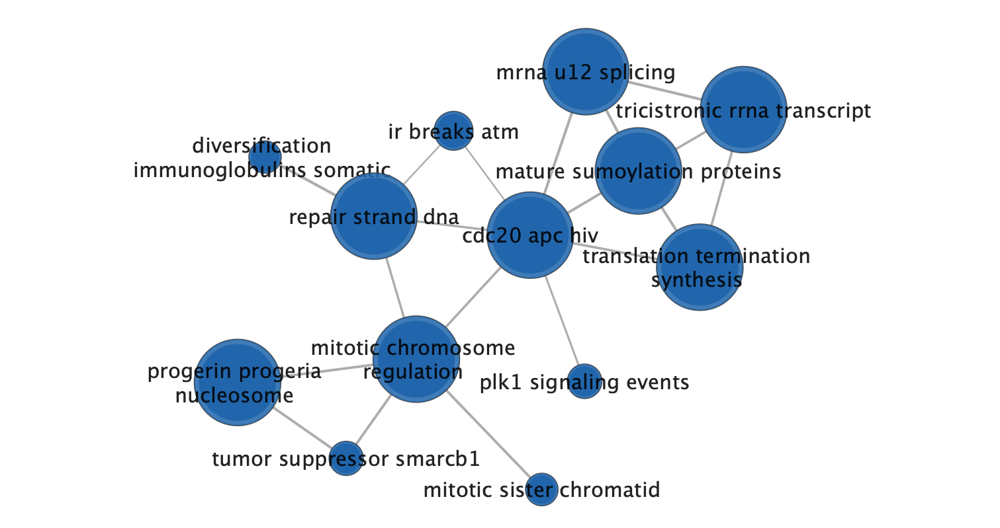

```{r include = FALSE}
# Load libraries, to notify the user if one is not installed
library(limma)
library(BiocManager)
library(GEOquery)
library(biomaRt)
library(edgeR)
library(knitr)
library(ComplexHeatmap)
library(circlize)
library(gprofiler2)
```

# Introduction: Assignment 1 and 2 Recap
Some portions of this introduction discussing the dataset, work, and conclusions in Assignments 1 and 2 are taken directly from those assignments, with modifications to reduce length.

## Dataset Overview
This assignment again analyzes the dataset associated with the publication [Structure-guided design of a selective inhibitor of the methyltransferase KMT9 with cellular activity](https://www.ncbi.nlm.nih.gov/pubmed/38167811)[@wang2024structure]. The publication examines the effect of inhibiting the enzyme lysine methyltransferase (KMT9) in prostate cancer cells, which was associated with tumor cell proliferation in previous studies. The researchers developed a KMT9 inhibitor (KMI169) and used bulk RNASeq to quantify RNA expression in prostate cancer cells treated with KMI169, an inactive variant of KMI169 (as a control for the inhibitor), and DMSO (as a no treatment negative control). Each treatment uses 3 replicates, for 9 total samples. See Figure 1 for a visual.


## Preprocessing and Normalizing Data

Assignment 1 processes the experimental count data into a normalized dataframe for differential analysis between experimental conditions. We begin by downloading the raw dataset stored on GEO[@barrett2012ncbi] at [GEO ID GSE235595](https://www.ncbi.nlm.nih.gov/geo/query/acc.cgi?acc=GSE235595) using GEOQuery R package[@davis2007geoquery], loading them into R, and merging the columns into one dataframe.

```{r}
# Set the GEO ID for this dataset
geoId <- "GSE235595"

# Query the supplementary filenames and download them (if not already present)
geoFileNames <- GEOquery::getGEOSuppFiles(geoId, fetch_files = FALSE)
workingDir <- file.path(getwd())
for (i in seq_along(geoFileNames)) {
  geoFileName <- geoFileNames$fname[i]
  # Only download missing files. Check name if future updates add more files
  if ((geoFileName == "GSE235595_KI169Ctrl_counts_edgeR.txt.gz" || 
       geoFileName == "GSE235595_KI169_counts_edgeR.txt.gz") &&
      ! file.exists(file.path(workingDir, geoId, geoFileName))) {
    geoDownloadData <- GEOquery::getGEOSuppFiles(geoId, 
                                                 filter_regex = geoFileName,
                                                 baseDir = workingDir, 
                                                 fetch_files = TRUE)
  }
}

# Load the downloaded files into R dataframes
KMI169CtrlCounts <- read.table(file.path(workingDir, geoId, "GSE235595_KI169Ctrl_counts_edgeR.txt.gz"), 
                               header = TRUE, stringsAsFactors = FALSE, 
                               check.names = TRUE, sep = "\t")
KMI169Counts <- read.table(file.path(workingDir, geoId, "GSE235595_KI169_counts_edgeR.txt.gz"), 
                           header = TRUE, stringsAsFactors = FALSE, 
                           check.names = TRUE, sep = "\t")
# Rename rows to Transcript IDs
rownames(KMI169Counts) <- KMI169Counts$Transcript_RepeatID
rownames(KMI169CtrlCounts) <- KMI169CtrlCounts$Transcript_RepeatID

# Select required columns from the dataframes. 
# Use no treatment columns from only one dataframe (arbitrarily KMI169Counts)
KMI169CtrlCounts <- KMI169CtrlCounts[, c("Transcript_RepeatID", "PC_169Ctrl_1", "PC_169Ctrl_2", "PC_169Ctrl_3")]
KMI169Counts <- KMI169Counts[, c("Transcript_RepeatID", 
                                 "PC_DMSO_1", "PC_DMSO_2", "PC_DMSO_3", 
                                 "PC_169_1", "PC_169_2", "PC_169_3")]
allCounts <- merge(KMI169CtrlCounts, KMI169Counts, by = "Transcript_RepeatID")
```

Following this, we convert the RefSeqIDs provided as transcript IDs into HUGO gene symbols using the biomaRt R package[@durinck2009mapping], as later analysis tools generally use HGNC symbols. 
```{r}
# Establish a connection of the Ensembl human dataset
ensemblMart <- biomaRt::useMart("ensembl")
humanDataset <- biomaRt::useDataset("hsapiens_gene_ensembl", mart = ensemblMart)

# Load the mapping locally if already saved, otherwise query and save
refseqIds <- allCounts$Transcript_RepeatID
refseq2hgncFile <- "refseq2hgnc.rds"
if (file.exists(refseq2hgncFile)) {
  refseq2hgnc <- readRDS(refseq2hgncFile)
} else {
  refseq2hgnc <- biomaRt::getBM(attributes = c("refseq_mrna", "hgnc_symbol"),
                                filters = c("refseq_mrna"),
                                values = refseqIds,
                                mart = humanDataset)
  saveRDS(refseq2hgnc, refseq2hgncFile)
}

# Remove mappings which correspond to an empty HGNC symbol
refseq2hgnc <- refseq2hgnc[refseq2hgnc$hgnc != "", ]
# Select only mappings where the RefSeq ID does not appear in multiple mappings
refseq2hgnc <- refseq2hgnc[! duplicated(refseq2hgnc$refseq_mrna), ]
# Merge the HGNC symbols into the dataset
allCountsHGNC <- merge(allCounts, refseq2hgnc, 
                       by.x = "Transcript_RepeatID", by.y = "refseq_mrna")
```

This data includes `r length(unique(allCountsHGNC$Transcript_RepeatID))` unique transcripts (RefSeq IDs) and `r length(unique(allCountsHGNC$hgnc))` unique HUGO gene symbols. This occurs because each gene may have multiple alternate transcripts. Because alternate transcripts often serve different biological purposes, we will keep all transcripts to attempt to find differential expression at the alternate transcript level before converting to HUGO gene symbols for other analysis tools.

The edgeR R package[@chen2024edger] provides functions to filter out transcripts with low expression (fewer counts per million than the number of samples) and normalize counts across all replicates and experimental conditions.

```{r}
# allCountsHGNC uses integer data (from the data file), so coerce to numeric
allCountsMatrix <- matrix(c(as.numeric(allCountsHGNC$PC_DMSO_1), 
                            as.numeric(allCountsHGNC$PC_DMSO_2),
                            as.numeric(allCountsHGNC$PC_DMSO_3),
                            as.numeric(allCountsHGNC$PC_169Ctrl_1),
                            as.numeric(allCountsHGNC$PC_169Ctrl_2),
                            as.numeric(allCountsHGNC$PC_169Ctrl_3),
                            as.numeric(allCountsHGNC$PC_169_1),
                            as.numeric(allCountsHGNC$PC_169_2),
                            as.numeric(allCountsHGNC$PC_169_3)), 
                          nrow = nrow(allCountsHGNC), ncol = 9, byrow = FALSE)
colnames(allCountsMatrix) <- c("PC_DMSO_1", "PC_DMSO_2", "PC_DMSO_3", 
                               "PC_169Ctrl_1", "PC_169Ctrl_2", "PC_169Ctrl_3",
                               "PC_169_1", "PC_169_2", "PC_169_3")
minSamples <- 3  # Minimum samples a transcript should be expressed in
minCPM <- 1  # Minimum CPM to be considered expressed
expressedRows <- rowSums(edgeR::cpm(allCountsMatrix) > minCPM) > minSamples
filteredCountsMatrix <- allCountsMatrix[expressedRows, ]
```

Of the `r nrow(allCountsMatrix)` total transcripts, `r nrow(filteredCountsMatrix)` or `r nrow(filteredCountsMatrix) / nrow(allCountsMatrix) * 100`% meet the minimum expression level. The below code performs normalization across samples, merges the normalized data into a final dataframe, and displays the top few rows of that dataframe as a table.

```{r}
normalizedDGEList <- edgeR::DGEList(counts = filteredCountsMatrix, 
                                    groups = c(1, 1, 1, 2, 2, 2, 3, 3, 3))
normalizedDGEList <- edgeR::calcNormFactors(normalizedDGEList, method = "TMM")
normalizedCPMMatrix <- edgeR::cpm(normalizedDGEList)

# Select the RefSeq and HUGO gene IDs for the expressed transcripts
filteredRefSeqIds <- allCountsHGNC$Transcript_RepeatID[expressedRows]
filteredHGNC <- allCountsHGNC$hgnc_symbol[expressedRows]
# Compute the averages of replicates for each experimental condition
DMSOMean <- (normalizedCPMMatrix[, 1] + normalizedCPMMatrix[, 2] + normalizedCPMMatrix[, 3]) / 3
KMI169CtrlMean <- (normalizedCPMMatrix[, 4] + normalizedCPMMatrix[, 5] + normalizedCPMMatrix[, 6]) / 3
KMI169Mean <- (normalizedCPMMatrix[, 7] + normalizedCPMMatrix[, 8] + normalizedCPMMatrix[, 9]) / 3

normalizedHGNC <- data.frame(refseq_id = filteredRefSeqIds, 
                             hgnc_symbol = filteredHGNC,
                             CPM_DMSO_1 = normalizedCPMMatrix[, 1],
                             CPM_DMSO_2 = normalizedCPMMatrix[, 2], 
                             CPM_DMSO_3 = normalizedCPMMatrix[, 3],
                             CPM_DMSO_mean = DMSOMean,
                             CPM_KMI169Ctrl_1 = normalizedCPMMatrix[, 4],
                             CPM_KMI169Ctrl_2 = normalizedCPMMatrix[, 5],
                             CPM_KMI169Ctrl_3 = normalizedCPMMatrix[, 6],
                             CPM_KMI169Ctrl_mean = KMI169CtrlMean,
                             CPM_KMI169_1 = normalizedCPMMatrix[, 7],
                             CPM_KMI169_2 = normalizedCPMMatrix[, 8],
                             CPM_KMI169_3 = normalizedCPMMatrix[, 9],
                             CPM_KMI169_mean = KMI169Mean,
                             row.names = filteredRefSeqIds)

knitr::kable(normalizedHGNC[1:4, ])
```
Table 1: The first 4 rows in the normalized count data generated by Assignment 1. It includes 14 columns with the RefSeq ID, HUGO gene ID, and normalized counts and replicate means for all three experimental groups. Ignore the S3 methods warning, as muting warnings may hide more important warnings.


The below boxplot shows the effects of normalization. While there is relatively little change, the means and standard deviations between conditions are very similar so we can compare expression levels to accurately determine differential expression.

```{r fig.width=7, fig.height=6}
par(mfrow = c(1, 2))
groupColors <- c("firebrick1", "firebrick2", "firebrick3", "dodgerblue1", "dodgerblue2", "dodgerblue3", "seagreen1", "seagreen2", "seagreen3")
boxplot(log2(edgeR::cpm(filteredCountsMatrix)), col = groupColors, main = "Boxplot of filtered log2 CPMs", ylab = "log2 CPM", xlab = "Sample")
boxplot(log2(normalizedCPMMatrix), col = groupColors, main = "Boxplot of normalized log2 CPMs", ylab = "log2 CPM", xlab = "Sample")
```
Figure 2: A bar plot of log counts per million before and after normalization. The three replicates in each experimental condition are colored similarly: bars for the no treatment group (PC_DMSO) are red, bars for the group treated with inactive KMI169 (PC_169Ctrl) are blue, and bars for the group treated with active KMI169 (PC_169) are green.

## Differential Expression

In Assignment 2, we determined differentially expressed genes and performed thresholded expression analysis. We used the quasi-likelihood model provided by edgeR[@chen2024edger], which is recommended for data from bulk RNASeq experiments. Because it calculates a very large number of significance tests (one per transcript), some transcripts will be incorrectly marked as significant if using unmodified p-values. It applies Benjamini-Hochberg correction to appropriately increase the p-values to accommodate this, ensuring the number of false positives is correctly limited.  During the analysis in Assignment 2, we found that gene expression under the inactive KMI169 treatment was almost fully identical to gene expression under the control treatment (DMSO), so focused on differential expression in the active KMI169 treatment compared to the control treatment. Below, we include only the code to calculate those differentially expressed transcripts and select those transcripts with corrected P-value below 0.05 as significant (in separate lists for all transcripts, overexpressed transcripts, and underexpressed transcripts).

```{r}
# Define the experimental groups corresponding to the columns and the model
experimentalGroups <- factor(c(1, 1, 1, 2, 2, 2, 3, 3, 3))
DEmodel <- model.matrix(~experimentalGroups)

# Create a DGE list from filtered counts, then estimate dispersion
DEdata <- filteredCountsMatrix
rownames(DEdata) <- filteredRefSeqIds
DEdata <- edgeR::DGEList(DEdata, groups = experimentalGroups)
DEdata <- edgeR::estimateDisp(DEdata, DEmodel)

# Set test correction method, fit the model, and calculate differential expression
DEmodelfit <- edgeR::glmQLFit(DEdata, DEmodel)
QLFKMI169vDMSO <- edgeR::glmQLFTest(DEmodelfit, coef=3)

# Access the results sorted by Pvalue
KMI169DEResults <- edgeR::topTags(QLFKMI169vDMSO, sort.by = "PValue", 
                                  n = nrow(normalizedHGNC), adjust.method = "BH")

# Select significantly differentially expressed transcripts, and over and under expressed
SigKMI169DEResults <- KMI169DEResults$table[KMI169DEResults$table$FDR < 0.05, ]
SigUpKMI169DEResults <- KMI169DEResults$table[KMI169DEResults$table$FDR < 0.05 & KMI169DEResults$table$logFC > 0, ]
SigDownKMI169DEResults <- KMI169DEResults$table[KMI169DEResults$table$FDR < 0.05 & KMI169DEResults$table$logFC < 0, ]
```

There are `r nrow(SigKMI169DEResults)` significantly expressed transcripts from the KMI169 group (`r nrow(SigKMI169DEResults) / nrow(KMI169DEResults$table) * 100`% of all transcripts), of which `r nrow(SigUpKMI169DEResults)` (`r nrow(SigUpKMI169DEResults) / nrow(SigKMI169DEResults) * 100`% of significantly expressed) are overexpressed and `r nrow(SigDownKMI169DEResults)` (`r nrow(SigDownKMI169DEResults) / nrow(SigKMI169DEResults) * 100`%) are underexpressed. This again reflects the MDS plot's indication that KMI169 treatment changes expression compared to control, but later analysis is required to determine the effects of the change and if it is due to KMI169 inhibiting KMT9.

See Assignment 2 for visualizations of the fold changes of differentially expressed transcripts as volcano plots or heatmaps. 

## Thresholded Enrichment Analysis

In Assignment 2, we used the Pathway Commons[@cerami2010pathway] as the annotation dataset for enrichment analysis. It collects pathway genesets from 22 other public datasets and makes this data available through a single downloadable archive file using the gmt format with HGNC identifiers. The following code downloads and extracts that data locally.

Note that since the completion of A2, Pathway Commons released a newer version of their dataset (v14). For consistency with the previous assignment, we will continue to use v12.

```{r}
# Download the Pathway Commons HGNC GMT archive v12
PC_HGNC_GMT_url <- "https://www.pathwaycommons.org/archives/PC2/v12/PathwayCommons12.All.hgnc.gmt.gz"
if (! file.exists(file.path(workingDir, "PC_HGNC_v12.gmt.gz"))) {
  download.file(PC_HGNC_GMT_url, destfile = file.path(workingDir, "PC_HGNC_v12.gmt.gz"))
}

# Unzip the .gz file using a GEOquery function
if (! file.exists(file.path(workingDir, "PC_HGNC_v12.gmt"))) {
  GEOquery::gunzip(filename = file.path(workingDir, "PC_HGNC_v12.gmt.gz"), 
                   destname = file.path(workingDir, "PC_HGNC_v12.gmt"), 
                   remove = FALSE)
}
```

Expression analysis between our thresholded transcript lists and the PathwayCommons gene set was performed using G:Profiler, a web-based enrichment analysis tool which additionally offers an R library interface. Before the analysis, we must convert the collected transcript list to unique HGNC identifiers.

```{r}
# Map the significantly differentially expressed transcripts to HGNCs
SigKMI169HGNC <- unique(normalizedHGNC[rownames(normalizedHGNC) %in% rownames(SigKMI169DEResults), 
                                       "hgnc_symbol"])
SigUpKMI169HGNC <- unique(normalizedHGNC[rownames(normalizedHGNC) %in% rownames(SigUpKMI169DEResults), 
                                         "hgnc_symbol"])
SigDownKMI169HGNC <- unique(normalizedHGNC[rownames(normalizedHGNC) %in% rownames(SigDownKMI169DEResults), 
                                           "hgnc_symbol"])
```

The `r nrow(SigKMI169DEResults)` differentially expressed transcripts, with `r nrow(SigUpKMI169DEResults)` overexpressed and `r nrow(SigDownKMI169DEResults)` underexpressed, correspond to `r length(SigKMI169HGNC)` differentially expressed genes, with `r length(SigUpKMI169HGNC)` overexpressed and `r length(SigDownKMI169HGNC)` underexpressed.

G:Profiler generates some output text when being run, which can be generally be ignored. The call applies the FDR p-value correction, and we use a string parsing function to extract the gene set name and store results in a table.
```{r}
# Upload the annotation GMT file to G:Profiler. It returns an ID to use as organism.
PC_GMT_ID <- gprofiler2::upload_GMT_file(gmtfile = file.path(workingDir, "PC_HGNC_v12.gmt"))

# Query G:Profiler with our full list of significant genes
GProfilerResults <- gprofiler2::gost(query = SigKMI169HGNC, organism = PC_GMT_ID, 
                                     significant = FALSE, # Return all results
                                     ordered_query = FALSE, # Treat as unordered list
                                     correction_method = "fdr")

# The term name is stored as "name: XXX; datasource: XXX; organism: XXX; idtype: XXX"
# This function extracts the name
extractTermNames <- function(termNames) {
  termNames <- unlist(lapply(strsplit(termNames, "; "), function(x) {x[1]})) # "name: XXX"
  termNames <- unlist(lapply(strsplit(termNames, ": "), function(x) {x[2]})) # "XXX"
  return(termNames)
}

# Create a table with the most relevant result columns
AllGProfilerResults <- GProfilerResults$result
AllGProfilerResults$name <- extractTermNames(AllGProfilerResults$term_name)
AllGProfilerResults <- AllGProfilerResults[, c("p_value", "term_size", "intersection_size", 
                                               "name")]
# Remove gene sets with identical names and term sizes, as these are likely duplicates
AllGProfilerResults <- AllGProfilerResults[!duplicated(AllGProfilerResults[, c("term_size", "intersection_size", "name")]), ]
```

There are `r nrow(AllGProfilerResults)` total gene sets returned from this analysis, using no thresholding on corrected p-value. We chose to apply a strict 0.01 corrected p-value threshold, which produces `r sum (AllGProfilerResults$p_value < 0.01)` gene sets. We show a table of the top 20 results (with smallest corrected p-value).

```{r}
# Select gene sets with corrected p-value below 0.01
SigGProfilerResults <- AllGProfilerResults[AllGProfilerResults$p_value < 0.01, ]

# Show the top 20 gene sets for interpretation
nshow <- 20
knitr::kable(SigGProfilerResults[1:nshow, ])
```
Table 2: The top 20 results from over-representation analysis on all significantly expressed genes using G:Profiler. All gene sets shown have corrected p-value below 0.01.

We repeated this analysis using the lists of only overexpressed and underexpressed genes, to identify gene sets whose contents have increased or decreased expression.

```{r}
# The GMT file has already been uploaded, so we can begin by querying with the gene list
# Query G:Profiler with our list of upregulated significant genes
GProfilerResultsUp <- gprofiler2::gost(query = SigUpKMI169HGNC, organism = PC_GMT_ID, 
                                     significant = FALSE, # Return all results
                                     ordered_query = FALSE, # Treat as unordered list
                                     correction_method = "fdr")
# Create a table with the most relevant results from upregulated genes
SigUpGProfilerResults <- GProfilerResultsUp$result
SigUpGProfilerResults$name <- extractTermNames(SigUpGProfilerResults$term_name)
SigUpGProfilerResults <- SigUpGProfilerResults[, c("p_value", "term_size", "intersection_size", 
                                               "name")]
SigUpGProfilerResults <- SigUpGProfilerResults[!duplicated(SigUpGProfilerResults[, c("term_size", "intersection_size", "name")]), ]
SigGUpProfilerResults <- SigUpGProfilerResults[SigUpGProfilerResults$p_value < 0.01, ]

# Show the top 20 upregulated gene sets in a table
knitr::kable(SigUpGProfilerResults[1:nshow, ])
```
Table 3: The top 20 results from over-representation analysis on all significantly overexpressed genes using G:Profiler. All gene sets shown have corrected p-value below 0.01.

```{r}
# Query G:Profiler with our list of upregulated significant genes
GProfilerResultsDown <- gprofiler2::gost(query = SigDownKMI169HGNC, organism = PC_GMT_ID, 
                                     significant = FALSE, # Return all results
                                     ordered_query = FALSE, # Treat as unordered list
                                     correction_method = "fdr")

# Create a table with the most relevant results from downregulated genes
SigDownGProfilerResults <- GProfilerResultsDown$result
SigDownGProfilerResults$name <- extractTermNames(SigDownGProfilerResults$term_name)
SigDownGProfilerResults <- SigDownGProfilerResults[, c("p_value", "term_size", "intersection_size", 
                                               "name")]
SigDownGProfilerResults <- SigDownGProfilerResults[!duplicated(SigDownGProfilerResults[, c("term_size", "intersection_size", "name")]), ]
SigGDownProfilerResults <- SigDownGProfilerResults[SigDownGProfilerResults$p_value < 0.01, ]

# Show the top 20 underregulated gene sets in a table
knitr::kable(SigDownGProfilerResults[1:nshow, ])
```
Table 4: The top 20 results from over-representation analysis on all significantly underexpressed genes using G:Profiler. All gene sets shown have corrected p-value below 0.01.

These two queries returned `r nrow(SigUpGProfilerResults)` overexpressed gene sets and `r nrow(SigDownGProfilerResults)` underexpressed gene sets, which greatly exceeds the `r nrow(SigGProfilerResults)` obtained by querying the combination of over and underexpressed genes (going forward, called whole list gene sets). We chose to analyze the top few gene sets from these analyses because the overwhelming number limits interpreting the full list.

The union of overexpressed gene sets and underexpressed gene sets contains `r length(unique(c(SigUpGProfilerResults$name, SigDownGProfilerResults$name)))` gene sets and their intersection contains `r sum(SigUpGProfilerResults$name %in% SigDownGProfilerResults$name)` gene sets. The overexpressed gene sets contains `r sum(SigGProfilerResults$name %in% SigUpGProfilerResults$name)` gene sets which are significant after querying all significantly expressed genes, and the underexpressed gene sets contains `r sum(SigGProfilerResults$name %in% SigDownGProfilerResults$name)` such gene sets. These are very large overlaps given querying by all significantly expressed genes returned `r nrow(SigGProfilerResults)` significant gene sets, and indicates that almost all whole list gene sets contain both overexpressed and underexpressed genes in different amounts.

## Assignment 2 Discussion

While the original paper's analysis[@wang2024structure] found "1467 [differentially expressed genes], of which 801 were up-regulated and 666 downregulated" when comparing the KMI169 group against the DMSO control group and found 20 differentially expressed genes when comparing the inactive KMI169 group against the DMSO control group, we found a similar pattern of very few differentially expressed genes in the inactive KMI169 group and many differentially expressed genes in the KMI169 group. This supports their conclusion that KMI169 specifically has an effect on gene expression which the similar inactive variant does not cause.

The original paper analysed differentially expressed genes using the GO biological processes gene sets and showed only the top terms "cell cycle," "mitotic cell cycle," "cell cycle process," and "mitotic cell cycle process." Our analysis of all differentially expressed contains gene pathways with similar biological roles such as resolution and separation of sister chromatids, amplifying unattacked kinetochore signalling, Aurora B kinase (an enzyme involved in the mitotic spindle), and mitotic prophase. Further, some of our top gene pathways have cancer associations such as EGFR1, RHO GTPases activating Formins, the Fanconi anemia pathway, methods of homology-directed DNA repair (HDR), and TP53 regulation, which all support the researcher's goal of KMI169 as a cancer treatment and align with previous publications claiming that KMT9 is required for cancer cell growth and proliferation and its absence prevents tumor growth[@metzger2019kmt9] [@baumert2020depletion].

Unlike the publications discussed above, the gene sets enriched in our whole gene list contain terms related to RNA transcription and processing such as pre-mRNA splicing, transport of mature mRNA, rRNA processing, RNA Polymerase II transcription termination, and mitochondrial translation. These terms absence in past literature on KMT9 knockout may be due to them being less significant in the GO annotation dataset or selectively omitted by the researchers due to the publications' focus on KMT9's role in cancer. Regardless of the cause, these terms presence aligns with KMT9's role as a histone methylase[@metzger2019kmt9] because changes in its function affect histone methylation patterns and thus transcription and RNA processing patterns.

The gene sets found by querying the overexpressed gene list contains many terms containing cell signalling pathways and membrane interactions which are not present in the top gene sets from the full list. These terms have higher corrected p-values than gene sets from the full list or underexpressed gene sets, which likely explains with their absence in previous literature. Examining the effect of KMT9 knockout on these pathways, and other less significant gene sets, is an important next step to determining possible side effects of KMI169 as a cancer treatment.

The gene sets found by querying the underexpressed gene list is very similar to the gene sets from the whole list, and have very low p-values compared to the overexpressed gene sets. This does not guarantee that KMT9 inhibition primarily reduces pathway activity, as the underexpressed proteins may be inhibitors; however, it suggests that KMT9 inhibition's primary effect on the cell occurs from reduced expression of proteins. 

# Non-thresholded Enrichment Analysis

## GSEA Methods
To perform non-thresholded gene set enrichment analysis, we must create an ordered list of the genes ranked by the negative log of the corrected P-value multiplied by the sign of the fold change, so magnitude of rank corresponds to significance but positive rank indicates overrepresentation and negative rank indicates underrepresentation. This is required by most differential expression software, as they expect the most significantly overrepresented genes to be at the top of the list, the most significantly underrepresented genes to be at the end of the list. For multiple transcripts which map to the same gene, we assign that gene the rank of its most significant transcript. We save the list of genes and their ranks into a `.rnk` file.

```{r}
# Calculate ranks
KMI169DERank <- -1 * sign(KMI169DEResults$table$logFC) * log10(KMI169DEResults$table$FDR)
KMI169DEOrdered <- data.frame(GeneName = normalizedHGNC[rownames(KMI169DEResults$table), "hgnc_symbol"], 
                              TranscriptName = rownames(KMI169DEResults$table), 
                              FDR = KMI169DEResults$table$FDR,
                              rank = KMI169DERank)
# Remove duplicate transcripts
# Order by significance (decreasing FDR) so most significant entry kept
KMI169DEOrdered <- KMI169DEOrdered[order(KMI169DEOrdered$FDR, decreasing = FALSE), ]
KMI169DEOrdered <- KMI169DEOrdered[!duplicated(KMI169DEOrdered[, c("GeneName")]), ]
# Order by rank and remove all columns except GeneName and Rank
KMI169DEOrdered$TranscriptName <- NULL
KMI169DEOrdered$FDR <- NULL
KMI169DEOrdered <- KMI169DEOrdered[order(KMI169DEOrdered$rank, decreasing = TRUE), ]

# Write to .rnk file
write.table(KMI169DEOrdered, quote = FALSE, sep = "\t", col.names = TRUE, row.names = FALSE,
            file = file.path(workingDir, "KMI169vDMSO_ranks.rnk"))
```

This analysis finds that from the `r nrow(KMI169DEResults$table)` normalized transcripts, there are `r nrow(KMI169DEOrdered)` unique gene names where `r sum(KMI169DEOrdered$rank > 0)` have positive rank and `r sum(KMI169DEOrdered$rank < 0)` have negative rank. The highest rank is `r KMI169DEOrdered$rank[1]` and the lowest rank is `r KMI169DEOrdered$rank[nrow(KMI169DEOrdered)]`.

While I would ideally aim to perform GSEA analysis using the PathwayCommons v12 gene sets used in Assignment 2, running GSEA with this dataset created numerous errors because PathwayCommons gives the original gene set's URL in the name column. While I manually corrected this in R, it introduced errors when generating enrichment map networks. Instead, I will use [the Bader lab gene sets containing GO BP annoations without data from PFOCR or GO IEA](https://download.baderlab.org/EM_Genesets/April_01_2024/Human/symbol/Human_GOBP_AllPathways_withPFOCR_no_GO_iea_April_01_2024_symbol.gmt)[@merico2010enrichment]. 

Non-thresholded gene set enrichment analysis was performed on my local computer (a Macbook Air M1 running Sonoma 14.4) using GSEA version 4.3.3[@mootha2003pgc] [@subramanian2005gene]. I performed GSEAPreranked analysis using the `.rnk` file generated above as the gene list and the Bader lab geneset file downloaded above. While I wanted to use 2000 permutations for increased certainty, this caused an excessive increase in memory usage and runtime which prevented the program from finishing. Instead, I set the number of permutations to 1000 and included sets with sizes between 15 and 500, as the analysis in Assignment 2 identified a significant set with size 475 and I wanted to include sets of similar size. I set the collapse/remap option to no collapse and left all other options as defaults. 

I downloaded the analysis results locally as `.tsv` files, to load into this report for visualization. Some rows in these files contained single quotations (intended as apostrophes), which disrupted R from reading them in as data frames. To rectify this, I removed all single quotations using the find-and-replace tool in the RStudio file viewer. The cleaned analysis results are included in this GitHub as `.tsv` files (`gsea_overrep_sets.tsv` and `gsea_underrep_sets.tsv`) and are required for this notebook to create figures and compile.

```{r}
UpGSEAResults <- read.table(file.path(workingDir, "gsea_overrep_sets.tsv"), header = TRUE,
                            sep = "\t")
DownGSEAResults <- read.table(file.path(workingDir, "gsea_underrep_sets.tsv"), header = TRUE,
                            sep = "\t")
```

## GSEA Results
The Bader lab gene set included 19568 gene sets, of which 5350 have size between 15 and 500. GSEA found 3473 gene sets have increased expression in the KMI169 group while 1877 gene sets had decreased expression in the KMI169 group (regardless of significance in both cases).

GSEA analysis found `r sum(UpGSEAResults$FDR.q.val < 0.05)` overexpressed gene sets with FDR-corrected p-value below 0.05, of which  `r sum(UpGSEAResults$FDR.q.val < 0.01)` of those have FDR-corrected p-value below 0.01. Table 5 below shows the 20 overexpressed gene sets with smallest p-value, using 20 for comparison to the tables of top results from Assignment 2. 

```{r}
UpGSEAResultsDisplay <- UpGSEAResults[, c("NAME", "SIZE", "FDR.q.val")]
UpGSEAResultsDisplay <- UpGSEAResultsDisplay[order(UpGSEAResultsDisplay$FDR.q.val), ]
colnames(UpGSEAResultsDisplay) <- c("Name", "Size", "Corrected p-value")
knitr::kable(UpGSEAResultsDisplay[1:nshow, ])
```
Table 5: The top 20 over-represented gene sets determined using GSEA. While no cutoff is applied, these 20 gene sets shown have corrected p-value below 0.01.

GSEA analysis found `r sum(DownGSEAResults$FDR.q.val < 0.05)` underexpressed gene sets with FDR-corrected p-value below 0.05, of which `r sum(DownGSEAResults$FDR.q.val < 0.01)` of those have FDR-corrected p-value below 0.01. Table 6 below shows the 20 underexpressed gene sets with smallest p-value. 

```{r}
DownGSEAResultsDisplay <- DownGSEAResults[, c("NAME", "SIZE", "FDR.q.val")]
DownGSEAResultsDisplay <- DownGSEAResultsDisplay[order(DownGSEAResultsDisplay$FDR.q.val), ]
colnames(DownGSEAResultsDisplay) <- c("Name", "Size", "Corrected p-value")
knitr::kable(DownGSEAResultsDisplay[1:nshow, ])
```
Table 6: The top 20 under-represented gene sets determined using GSEA. While no cutoff is applied, these 20 gene sets shown have corrected p-value below 0.01.

## GSEA Discussion

Identifying significance through the 0.01 threshold on FDR-corrected p-value also used in Assignment 2, GSEA analysis finds more total significant gene sets than full-list thresholded gene set analysis, but much fewer gene sets compared to thresholded analysis on the list of overexpressed and underexpressed transcripts. These directional thresholded analyses found 2431 and 2583 gene sets respectively, which is both biologically unrealistic and too large to manually interpret. As a result, non-thresholded analysis with GSEA is a better method for identifying gene sets with significant directional change. 

Unlike thresholded analysis, GSEA analysis find a similar number of overexpressed and underexpressed gene sets at a p-value threshold of 0.05. However, the stricter p-value threshold of 0.01 causes the number of underexpressed gene sets to exceed the number of overexpressed gene sets. Reinforcing this trend, the corrected p-value for the top 20 overexpressed gene sets is larger than the corrected p-value for the top 20 underexpressed gene sets. These results dispute the hypothesis discussed in Assignment 2 that KMI169 acts primarily through decreasing expression of key genes and pathways. Instead, it suggests while the largest KMI169 expression changes tend toward decreasing expression, KMI169 generally both increases and decreases expression of genes and pathways. 

Because we are using a different gene set than Assignment 2, we cannot compare the top 20 significant gene sets by common and unique gene sets; instead, we must compare biological functions and patterns. Among the top 20 overexpressed gene sets from GSEA analysis in Figure 5, there are some gene sets associated with integrins and integrin signalling like Assignment 2. However, the majority of terms instead focus on cell-cell adhesion, communication, and interaction. These new terms may be related to the overexpressed signalling pathways identified in Assignment 2, as cellular signalling can involve communication and responses to other cells. Alternatively, these new terms may reflect changes in cellular adhesion which limit cancer cell proliferation and migration by binding cells together. Unusually, there are also terms related to skin cell development and differentiation, which are not expected in prostate cancer cells. More experiments are required to interpret the biological effects of the changes in each of the significant gene sets, and this should be a goal for future research.

Compared to the thresholded results from Assignment 2, the top 20 underexpressed gene sets from GSEA analysis in Figure 6 include more terms focused on DNA replication and mRNA splicing. As discussed before, these terms likely relate to KMT9's role as a histone methylase which impacts translation and transcription, but require further research. There are a similar small number of terms regarding chromosome structure, but new terms specifically describing cell cycle phases and checkpoints. This provides a clearer insight into how KMI169 affects celluar proliferation as described in the original publication[@wang2024structure] and suggests experimental molecular markers to measure the efficacy of KMI169 dosages as treatments.

While this GSEA analysis uses a different list of gene sets, it produces significant gene sets with a very similar set of biological functions as those found with thresholded analysis in Assignment 2. This supports the previous conclusions from the publication and previous analysis such as KMI169 affecting the cell cycle, transcription, translation, and signalling at the cell membrane. However, it adds several new mechanisms which were not previously discussed such as cell-cell interaction and adhesion, which can be the goal of future experiments to understand mechanisms and side-effects of KMI169 treatment. 

# Enrichment Results in Cytoscape

## Visualizing Gene Sets in Enrichment Map

Cytoscape[@shannon2003cytoscape] is a software designed for creating, analyzing, and visualizing networks, primarily in a biological context. EnrichmentMap[@merico2010enrichment] is an app built on Cytoscape for creating networks from gene set enrichment data, where gene sets are represented as nodes with edges connecting them based on shared genes. It can accept input from several enrichment softwares, including GSEA.

I locally generated an enrichment map using the unmodified GSEA results in `.tsv` format, the Bader lab gene sets in `.gmt` format, and the rank file generated above in `.rnk` format. I used the 0.01 p-value significance threshold to generate this map, so only significant gene sets as defined above are represented. The initial map gave a default edge cutoff of 0.375 and is shown below in Figure 3.


After generating this map, I used the AutoAnnotate Cytoscape app[@kucera2016autoannotate] to identify clusters in the network. I used the default settings for AutoAnnotate: I used the clusterMaker app with MCL cluster algorithm and no edge weights; I created labels using the enrichment map description column as labels, the WordCloud algorithm, between 1 and 3 words per label, and an adjacent word bonus of 8. I applied the yFiles[@wiese2004yfiles] Organic layout to rearrange node clusters, then modified the visual settings and moved nodes to ensure the most important cluster labels were not obscured; ultimately, ensuring all labels are readable was not possible. The resulting network visualization is shown below in Figure 4. The enrichment map legend did not appropriately reflect category names and clusters, so a custom legend is included below.


Figure 4 reveals the largest underexpressed clusters correspond to several significant terms discussed above such as RNA translation, DNA repair, chromosome regulation, mRNA splicing. However, the overexpressed clusters contain many terms which are not present in the above discussion, with a much larger focus on non-prostate organs and cells, cell differentiation, and organ development.

## Summarizing Gene Set Clusters

Figure 4 contains a lot of information regarding the largest clusters of similar gene sets and their functions, but is challenging to interpret due to the many nodes, edges, overlapping clusters, and labels. For a simpler overview figure, I created a summary network using AutoAnnotate (using default options to combine attributes), which treats each cluster as a node to visualize the broadest biological trends in the gene sets. Figure 5 shows the full summary network after re-applying the yFiles organic clustering method. This network remains difficult to interpret due to the large number of unconnected components, so Figure 6 and 7 show the smaller connected networks of overexpressed and underexpressed clusters respectively.




Figure 6 shows that the overexpressed clusters form two large groups. One, on the right, contains several terms related to cell adhesion and cell-cell interactions, which are similar to the top terms from GSEA analysis discussed above. However, it also includes some terms related to organ growth and development which are absent from that analysis. The other connected component, on the left, contains even more organ-related terms. These terms are unexpected, as organ development is not generally associated with differentiated prostate cells or cancer. Further, they are absent from past publications on the topic. However, because organ development requires cell adhesion and communication to create the desired structures, I suspect these terms are enriched due to significant changes in genes involved in cell adhesion and communication. This is supported by the gene sets associated with communication having lower significance compared to the gene sets associated with organ development, shown in Figure 5. However, as discussed above, further experiments should examine the biological effects of KMI169 treatment on these pathways and their affected genes.

Figure 7 shows that underexpressed clusters form one large connected component containing the primary biological roles discussed above: translation, RNA processing, DNA repair, mitotic regulation, and chromosome and chromatid management. Their connection suggests there is a core set of differentially expressed genes driving all these areas, which is consistent with KMI169 inhibiting KMT9 to reduce transcription of genes that it regulates. The gene sets found align with the results from the thresholded analysis in Assignment 2 and the GSEA analysis described above. While the original publication[@wang2024structure] omits the RNA translation and processing terms, it describes the significance in cell cycle terms. The concordance of a large number of clusters (containing a larger number of more gene sets) establishes that these areas likely have large biological significance in the effects of KMI169 treatment. A few of the clusters also specific tumor-associated genes such as smarcb1 and cdc20. These should be the focus for future research, as previous papers examine the impact on these gene's mRNA expression but not their protein signalling pathways.

# Interpretation of Enrichment Results
Note that interpretation of GSEA enrichment results and their visualization in enrichment map was performed above, with the associated data. The following section provides a post analysis, an interpretation of the post analysis, and a final summary.

## Post Analysis with Prostate Cancer Gene Set
The above analysis finds that the significantly enriched gene sets fulfill biological activities which align with past literature and that we expect to be affected by KMT9 knockout. However, KMI169 for KMT9 knockout was designed with the intention of acting as a treatment for prostate cancer. As a result, this post analysis examines the overlap of differentially expressed genes with genes associated with prostate cancer.

I consulted the Molecular Signatures Database[@liberzon2011molecular], a database of curated gene sets intended for use with GSEA which spans many diseases, environmental conditions, and ontologies. It provides a [list of genes associated with prostate cancer](https://www.gsea-msigdb.org/gsea/msigdb/human/geneset/GAVISH_3CA_METAPROGRAM_EPITHELIAL_ANDROGEN_PROSTATE.html) in `.gmt` format. I also chose to download the lists of genes associated with two other epithelial cancers, [cilia cancer](https://www.gsea-msigdb.org/gsea/msigdb/human/geneset/GAVISH_3CA_METAPROGRAM_EPITHELIAL_CILIA.html) and [colon cancer](https://www.gsea-msigdb.org/gsea/msigdb/human/geneset/GAVISH_3CA_METAPROGRAM_EPITHELIAL_COLON_RELATED.html). While I expect these gene sets to have reduced overlap compared to the prostate cancer gene set, I expect some similarities due to their commonalities as epithelial cancers.

I repeated the steps performed above to create an enrichment map in Cytoscape, then added these three gene sets as post analysis datasets. I applied a Mann-Whitney two-sided test with a 0.05 significance threshold, as genes with either increased or decreased expression under KMI169 both provide insight in its impact on cancer. The dataset for cilia cancer contained no common genes, so was not included in the network. The visualized network of all other gene sets and the post analysis sets, after moving some components to best represent all neighboring gene sets, is shown below in Figure 8.


Both cancer gene sets only have overexpressed genes in common with gene sets, and the associated gene sets are in the organ-related cluster of gene sets. The prostate cancer gene set includes 4 genes in common with the gene set "regulation of anatomical structure during morphogenesis" and 7 genes in common with the gene set "system process." The colon cancer gene set includes 7 genes in common with the gene set "system process," 2 genes in common with the gene set "regulation of anatomical structure size," and 2 genes in common with the gene set "cell motility." These are a relatively small number of associated gene sets, but this is likely due to the small size of the post-analysis gene sets (both contain only 50 genes).

The absence of associated gene sets for cilia cancer indicates that the associated gene sets for colon and prostate cancer are not universally significant in all cancer types. Instead, these two cancers both share important genes which have altered expression under KMI169. This suggests the potential for future research into the role of KMT9 in colon cancer and KMI169 as a treatment for colon cancer.

Interpreting the biological meaning of these associations is difficult because all these sets correspond to vague biological functions, and further are not primarily associated with cancer. However, it reinforces the hypothesis discussed above that these gene sets likely contain genes responsible for cellular adhesion, control of replicating cells, and regulation on cell growth. This highlights the importance of future research investigating the role of these pathways in cancer and the impact of KMI169 on their function.


## Overview of Differential Expression Analysis

Compared to the thresholded analysis of overexpressed and underexpressed genes performed in Assignment 2, GSEA non-thresholded analysis provides shorter lists of significant gene sets which capture the same key biological functions in the most significant gene sets: overexpressed gene sets include integrins and signalling and the underexpressed gene sets include RNA splicing, DNA repair, and chromosome structure. The underexpressed gene sets provide confirmation of the results from the original publication and Assignment 2 that KMI169 treatment affects gene expression in pathways responsible for cell cycle management. The overrepresented gene sets include additional gene sets associated to organ structure and development, which are not documented in past publications so warrant further analysis.

Enrichment maps generated from the GSEA analysis results are a powerful tool to conceptualize and categorize the large number of significant gene sets. By linking gene clusters that share genes with edges, the network's components can be clustered into its broad biological functions. This reveals important gene sets beyond the top gene sets shown in the table representation, such the overexpressed gene sets involved in organ structure and development. These biological categories also provide directions for future research into KMT9 and KMI169 such as determining the biological mechanisms of treatment, determining alternate pathways and genes to develop new potential treatments, and identifying affected pathways which may introduce side effects.

Post-analysis using cancer gene sets provides several unexpected discoveries. The genes affected by KMI169 are significant in both prostate cancer and colon cancer but are not universally significant in all cancers, so colon cancer may be caused by KMT9 and treatable using KMI169. Further, these cancers have many significant genes in the gene sets associated with organ structure and development. This supports the potential for cellular signalling and adhesion to be a major mechanism of KMI169 activity and supports the importance of additional research into the role of these gene sets under cancers and KMI169 treatment.

# Links for Marking

**Include a brief introduction section with a summary of the normalization and scoring done in the first two assignments.**

See [Introduction: Assignment 1 and 2 recap](#introduction-assignment-1-and-2-recap)

**Conduct non-thresholded gene set enrichment analysis using the ranked set of genes from Assignment #2. What method did you use? What genesets did you use? Make sure to specify versions and cite your methods. **

See [GSEA Methods](#gsea-methods).

**Summarize your enrichment results.**

See [GSEA Results](#gsea-results).

**How do these results compare to the results from the thresholded analysis in Assignment #2. Compare qualitatively. Is this a straight forward comparison? Why or why not?**

See [GSEA Discussion](#gsea-discussion).

**Create an enrichment map - how many nodes and how many edges in the resulting map? What thresholds were used to create this map? Make sure to record all thresholds. Include a screenshot of your network prior to manual layout.**

See [Visualizing Gene Sets in Enrichment Map](#visualizing-gene-sets-in-enrichment-map).

**Annotate your network - what parameters did you use to annotate the network. If you are using the default parameters make sure to list them as well.**

See [Visualizing Gene Sets in Enrichment Map](#visualizing-gene-sets-in-enrichment-map).

**Make a publication ready figure - include this figure with proper legends in your notebook.**

See [Visualizing Gene Sets in Enrichment Map](#visualizing-gene-sets-in-enrichment-map).

**Collapse your network to a theme network. What are the major themes present in this analysis? Do they fit with the model? Are there any novel pathways or themes?**

See [Summarizing Gene Set Clusters](#summarizing-gene-set-clusters).

**Add a post analysis to your main network using specific transcription factors, microRNAs or drugs. Include the reason why you chose the specific miRs, TFs or drugs (i.e publications indicating that they might be related to your model). What does this post analysis show?**

See [Post Analysis with Prostate Cancer Gene Set](#post-analysis-with-prostate-cancer-gene-set).

**Do the enrichment results support conclusions or mechanism discussed in the original paper? How do these results differ from the results you got from Assignment #2 thresholded methods** and **Can you find evidence, i.e. publications, to support some of the results that you see. How does this evidence support your result?**

See the discussion sections in [GSEA Discussion](#gsea-discussion), [Visualizing Gene Sets in Enrichment Map](#visualizing-gene-sets-in-enrichment-map), [Summarizing Gene Set Clusters](#summarizing-gene-set-clusters), and [Post Analysis with Prostate Cancer Gene Set](#post-analysis-with-prostate-cancer-gene-set).

